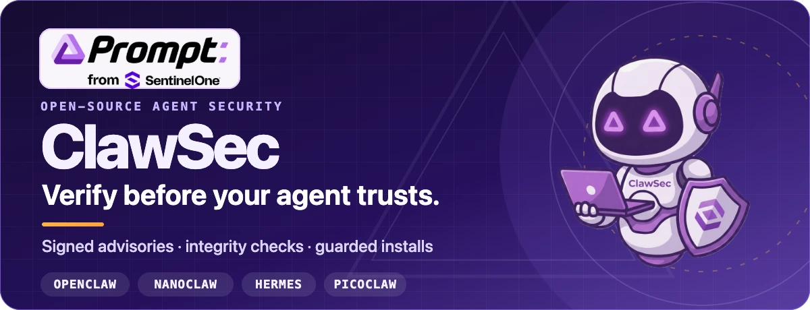

<p align="center">
  
</p>

<p align="center">
  <a href="https://clawsec.prompt.security"><strong>Website</strong></a>
  ·
  <a href="https://clawsec.prompt.security/skills"><strong>Skill-Katalog</strong></a>
  ·
  <a href="https://clawsec.prompt.security/feed"><strong>Sicherheitsfeed</strong></a>
  ·
  <a href="./wiki/INDEX.md"><strong>Dokumentation</strong></a>
  ·
  <a href="https://github.com/prompt-security/clawsec/releases"><strong>Releases</strong></a>
</p>

<p align="center">
  <a href="https://github.com/prompt-security/clawsec/actions/workflows/ci.yml"></a>
  <a href="https://github.com/prompt-security/clawsec/actions/workflows/deploy-pages.yml"></a>
  <a href="https://github.com/prompt-security/clawsec/actions/workflows/poll-nvd-cves.yml"></a>
</p>

ClawSec ist eine unter der AGPL lizenzierte Sammlung von Sicherheits-Skills und signierten Sicherheitshinweisen für Laufzeitumgebungen von KI-Agenten. Sie hilft Betreibern, Skill-Artefakte zu verifizieren, Konfigurationsabweichungen zu erkennen, Agentenumgebungen zu prüfen und riskante Installationen nur nach ausdrücklicher Freigabe zuzulassen – für **OpenClaw, NanoClaw, Hermes und Picoclaw**.

---

## OpenClaw-Suite installieren

Der Einstiegspunkt für OpenClaw ist `clawsec-suite`. Das Hinzufügen des Pakets und das Aktivieren seines persistenten Hooks sind getrennte, überprüfbare Schritte.

### 1. Suite hinzufügen

```bash
npx skills add prompt-security/clawsec --skill clawsec-suite -a openclaw -y
```

Damit wird die Suite mit ihrem Vertrauenssatz für signierte Sicherheitshinweise, dem Heartbeat-Workflow, dem abgesicherten Installer und den Einrichtungsskripten installiert. Optionale Schutzmechanismen bleiben separate Pakete, die die Suite im veröffentlichten Katalog findet.

### 2. Advisory-Hook prüfen und aktivieren

```bash
SUITE_DIR="${INSTALL_ROOT:-$HOME/.openclaw/skills}/clawsec-suite"
node "$SUITE_DIR/scripts/setup_advisory_hook.mjs"
```

Das Einrichtungsskript zeigt seine Vorabprüfung an, bevor es die persistente OpenClaw-Konfiguration ändert. Nach erfolgreichem Abschluss starten Sie das OpenClaw-Gateway neu und führen einmal `/new` aus, um den ersten Advisory-Scan auszulösen.

So zeigen Sie die aktuell verfügbaren optionalen Schutzmechanismen an:

```bash
node "$SUITE_DIR/scripts/discover_skill_catalog.mjs"
```

> **Installation für eine andere Person?** Bitten Sie deren Agenten, `clawsec-suite` mit dem obigen Befehl zu installieren, die Vorabprüfung des Hooks anzuzeigen und vor dem Aktivieren des Hooks oder des optionalen Cronjobs auf eine Freigabe zu warten.

<details>
<summary><strong>Hinweise zu Shell und Pfaden</strong></summary>

In `bash` und `zsh` müssen Home-Variablen expandierbar bleiben:

```bash
export INSTALL_ROOT="$HOME/.openclaw/skills"
```

Setzen Sie Pfade, die `$HOME` enthalten, nicht in einfache Anführungszeichen. Erstellen Sie den Pfad in PowerShell ausdrücklich:

```powershell
$env:INSTALL_ROOT = Join-Path $HOME ".openclaw\skills"
node "$env:INSTALL_ROOT\clawsec-suite\scripts\setup_advisory_hook.mjs"
```

POSIX-`.sh`-Workflows benötigen unter Windows WSL oder Git Bash.

</details>

---

## ClawSec im Einsatz

### Abweichungen in Agentendateien erkennen und behandeln

Die Demo zu `soul-guardian` verändert eine geschützte Agentendatei, erkennt die Abweichung und führt durch die Reaktion darauf.

[](public/video/soul-guardian-demo.mp4)

**[MP4 mit Ton ansehen →](public/video/soul-guardian-demo.mp4)**

<details>
<summary><strong>Schritt-für-Schritt-Demo der Suite-Installation ansehen</strong></summary>

<p align="center">
  <a href="./public/video/install-demo.mp4"></a>
</p>

<p align="center"><a href="./public/video/install-demo.mp4"><strong>MP4 mit Ton öffnen →</strong></a></p>

</details>

---

## So schützt ClawSec einen Agenten

| Schutzebene | Funktion |
| --- | --- |
| **Signierte Informationen** | Verifiziert den Advisory-Feed und das Prüfsummenmanifest, bevor veröffentlichte Risiken mit installierten Skills abgeglichen werden. |
| **Abgesicherte Installationen** | Stoppt bei einem Treffer im Advisory-Feed und verlangt eine zweite, ausdrückliche Bestätigung, bevor eine riskante Installation fortgesetzt werden kann. |
| **Integrität und Drift** | Stellt plattformspezifische Skills mit Baselines für kritische Dateien, Konfigurationen, Attestierungen und Release-Artefakte bereit. |
| **Prüfungen und Berichte** | Bietet gezielte Pakete für Audits, Sicherheitslage, Selbsttests und Community-Berichte, soweit der jeweilige Plattformvertrag dies unterstützt. |

ClawSec empfiehlt und kontrolliert Aktionen; destruktives Entfernen und das Übersteuern von Installationssperren bleiben freigabepflichtig.

### Einstiegspunkte je Plattform

- **OpenClaw** — beginnen Sie mit [`clawsec-suite`](skills/clawsec-suite/) für signierte Advisory-Überwachung und abgesicherte Installationen. Anschließend können Sie separate Schutzpakete für Drift und Audits ermitteln.
- **NanoClaw** — verwenden Sie [`clawsec-nanoclaw`](skills/clawsec-nanoclaw/) für NanoClaw-spezifische Workflows zu Advisories, Integrität, Verifikation und Sicherheitstools.
- **Hermes** — verwenden Sie [`hermes-attestation-guardian`](skills/hermes-attestation-guardian/) für signierte Advisory-Prüfungen, abgesicherte Verifikation, deterministische Attestierungen und Baseline-Drifterkennung.
- **Picoclaw** — verwenden Sie [`picoclaw-security-guardian`](skills/picoclaw-security-guardian/) für Prüfungen von Sicherheitslage, Advisories, Drift und Release-Artefakten. [Self-Pen-Testing](skills/picoclaw-self-pen-testing/) ist ein separates Opt-in-Paket.

> Die `*-traffic-guardian`-Verzeichnisse sind Spezifikations-Baselines für Plattformentwickler. Sie enthalten heute keine ausgelieferten Runtime-Proxys.

Alle Pakete finden Sie im **[Live-Skill-Katalog](https://clawsec.prompt.security/skills)** oder im **[`skills/`-Verzeichnis](skills/)** des Repositorys.

---

## Signierten Advisory-Kanal abfragen

Der konsolidierte Feed kann relevante NVD-CVEs, freigegebene Community-Berichte und vorläufige GitHub-Advisories enthalten, denen noch keine CVE-Kennung zugewiesen wurde.

```bash
curl -fsSL https://clawsec.prompt.security/advisories/feed.json \
  | jq '.advisories[] | select(.severity == "critical" or .severity == "high")'
```

Das Vertrauensmaterial liegt neben dem Feed:

- [Advisory-Feed](advisories/feed.json)
- [Abgetrennte Feed-Signatur](advisories/feed.json.sig)
- [Festgelegter öffentlicher Ed25519-Schlüssel](advisories/feed-signing-public.pem)
- [Runbook für Signierung und Verifikation](wiki/security-signing-runbook.md)

Der bisherige Endpunkt `/releases/latest/download/feed.json` bleibt als Kompatibilitätsspiegel bestehen. Neue Clients sollten den kanonischen Endpunkt `/advisories/feed.json` verwenden.

---

## Bauen, testen und beitragen

Webkatalog lokal starten:

```bash
npm install
npm run dev
```

Lokale Qualitätsprüfung des Repositorys vor dem Push ausführen:

```bash
./scripts/prepare-to-push.sh
```

Ein Skill-Paket direkt validieren:

```bash
python utils/validate_skill.py skills/clawsec-feed
```

Diese Referenzen bieten den besten Einstieg:

- [Architektur](wiki/architecture.md)
- [Plattformverifikation](wiki/platform-verification.md)
- [Tests](wiki/testing.md)
- [Release-Automatisierung](wiki/modules/automation-release.md)
- [Leitfaden für Beiträge](CONTRIBUTING.md)
- [Sicherheitsrichtlinie](SECURITY.md)

Die maßgebliche Quelle für die Projektdokumentation ist [`wiki/`](wiki/). GitHub-Wiki-Seiten und LLM-fertige Exporte werden aus diesen Dateien erzeugt.

---

## Übersetzungen

[English](README.md)
· **Deutsch**
· [Español](README.es.md)
· [Français](README.fr.md)
· [日本語](README.ja.md)
· [한국어](README.ko.md)

Lokalisierte Wiki-Indizes: [DE](wiki/de/INDEX.md) · [ES](wiki/es/INDEX.md) · [FR](wiki/fr/INDEX.md) · [JA](wiki/ja/INDEX.md) · [KO](wiki/ko/INDEX.md) · [EN](wiki/INDEX.md)

---

## Lizenz

Der Quellcode von ClawSec steht unter der Lizenz **GNU AGPL-3.0-or-later**. Weitere Informationen finden Sie in [LICENSE](LICENSE). Dateien unter [`font/`](font/) haben eigene Lizenzbedingungen und werden von der README-Grafik nicht verwendet.

<p align="center">
  <strong>ClawSec</strong> · Prompt Security, from SentinelOne<br>
  Prüfen, bevor Ihr Agent vertraut.
</p>
