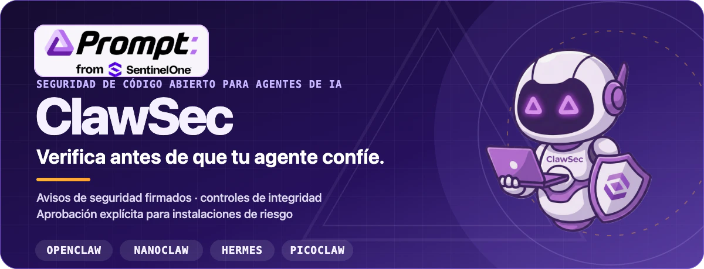

<p align="center">
  
</p>

<p align="center">
  <a href="https://clawsec.prompt.security"><strong>Sitio web</strong></a>
  ·
  <a href="https://clawsec.prompt.security/#/skills"><strong>Catálogo de habilidades</strong></a>
  ·
  <a href="https://clawsec.prompt.security/feed"><strong>Feed de seguridad</strong></a>
  ·
  <a href="./wiki/es/INDEX.md"><strong>Documentación</strong></a>
  ·
  <a href="https://github.com/prompt-security/clawsec/releases"><strong>Releases</strong></a>
</p>

<p align="center">
  <a href="https://github.com/prompt-security/clawsec/actions/workflows/ci.yml"></a>
  <a href="https://github.com/prompt-security/clawsec/actions/workflows/deploy-pages.yml"></a>
  <a href="https://github.com/prompt-security/clawsec/actions/workflows/poll-nvd-cves.yml"></a>
</p>

ClawSec es una colección de habilidades de seguridad e inteligencia firmada sobre avisos, con licencia AGPL, para runtimes de agentes de IA. Ayuda a los operadores a verificar artefactos de habilidades, detectar deriva en la configuración, auditar entornos de agentes y exigir aprobación para instalaciones de riesgo en **OpenClaw, NanoClaw, Hermes y Picoclaw**.

---

## Instala la suite para OpenClaw

El punto de entrada para OpenClaw es `clawsec-suite`. Añadir el paquete y activar su hook persistente son pasos separados que se pueden revisar individualmente.

### 1. Añade la suite

```bash
npx skills add prompt-security/clawsec --skill clawsec-suite -a openclaw --global -y
```

Esto instala la suite con su conjunto de confianza para avisos firmados, el flujo de heartbeat, el instalador con controles de seguridad y los scripts de configuración. Las protecciones opcionales siguen siendo paquetes separados que la suite descubre en el catálogo publicado.

### 2. Revisa y activa el hook de avisos

```bash
SUITE_DIR="${INSTALL_ROOT:-$HOME/.openclaw/skills}/clawsec-suite"
node "$SUITE_DIR/scripts/setup_advisory_hook.mjs"
```

El script de configuración muestra una revisión previa antes de cambiar la configuración persistente de OpenClaw. Cuando termine correctamente, reinicia el gateway de OpenClaw y ejecuta `/new` una vez para iniciar el primer análisis de avisos.

Para consultar las protecciones opcionales disponibles actualmente:

```bash
node "$SUITE_DIR/scripts/discover_skill_catalog.mjs"
```

> **¿Lo instalas para otra persona?** Pide a su agente que instale `clawsec-suite` con el comando anterior, muestre la revisión previa del hook y espere la aprobación antes de activar el hook o el trabajo cron opcional.

<details>
<summary><strong>Notas sobre shells y rutas</strong></summary>

En `bash` y `zsh`, permite que las variables del directorio personal se expandan:

```bash
export INSTALL_ROOT="$HOME/.openclaw/skills"
```

No uses comillas simples en rutas que contengan `$HOME`. En PowerShell, construye la ruta explícitamente:

```powershell
$env:INSTALL_ROOT = Join-Path $HOME ".openclaw\skills"
node "$env:INSTALL_ROOT\clawsec-suite\scripts\setup_advisory_hook.mjs"
```

Los flujos POSIX `.sh` requieren WSL o Git Bash en Windows.

</details>

---

## Míralo en acción

### Detecta y responde a cambios en archivos del agente

La demostración de `soul-guardian` modifica un archivo protegido del agente, detecta la discrepancia y recorre el proceso de respuesta.

[](public/video/soul-guardian-demo.mp4)

**[Ver el MP4 con audio →](public/video/soul-guardian-demo.mp4)**

<details>
<summary><strong>Ver el recorrido de instalación de la suite</strong></summary>

<p align="center">
  <a href="./public/video/install-demo.mp4"></a>
</p>

<p align="center"><a href="./public/video/install-demo.mp4"><strong>Abrir el MP4 con audio →</strong></a></p>

</details>

---

## Cómo protege ClawSec a un agente

| Capa de protección | Función |
| --- | --- |
| **Inteligencia firmada** | Verifica el feed de avisos y el manifiesto de checksums antes de comparar los riesgos publicados con las habilidades instaladas. |
| **Instalaciones con controles de seguridad** | Se detiene cuando encuentra coincidencias con avisos y exige una segunda confirmación explícita antes de continuar con una instalación de riesgo. |
| **Integridad y deriva** | Proporciona a las habilidades específicas de cada plataforma líneas base para archivos críticos, configuración, atestaciones y artefactos de release. |
| **Auditorías e informes** | Ofrece paquetes específicos de auditoría, postura, autoevaluación e informes comunitarios cuando el contrato de la plataforma los admite. |

ClawSec recomienda y controla acciones; las eliminaciones destructivas y las excepciones de instalación siguen requiriendo aprobación.

### Puntos de entrada por plataforma

- **OpenClaw** — empieza con [`clawsec-suite`](skills/clawsec-suite/) para el monitoreo de avisos firmados y las instalaciones con controles de seguridad; después descubre las protecciones separadas de deriva y auditoría.
- **NanoClaw** — usa [`clawsec-nanoclaw`](skills/clawsec-nanoclaw/) para los flujos de avisos, integridad, verificación y herramientas de seguridad específicos de NanoClaw.
- **Hermes** — usa [`hermes-attestation-guardian`](skills/hermes-attestation-guardian/) para comprobaciones de avisos firmados, verificación con controles de seguridad, atestaciones deterministas y detección de deriva respecto a la línea base.
- **Picoclaw** — usa [`picoclaw-security-guardian`](skills/picoclaw-security-guardian/) para comprobar la postura, los avisos, la deriva y los artefactos de release. Las [autopruebas de penetración](skills/picoclaw-self-pen-testing/) son un paquete opcional separado.

> Los directorios `*-traffic-guardian` son especificaciones base para quienes desarrollan las plataformas. Actualmente no incluyen proxies de runtime listos para usar.

Explora todos los paquetes en el **[catálogo de habilidades en vivo](https://clawsec.prompt.security/#/skills)** o en el **[directorio `skills/`](skills/)** del repositorio.

### Matriz de funciones por skill

La comparación completa de paquetes se conserva en el wiki, incluida la cobertura disponible, limitada y solo de especificación.

**[Comparar todas las skills en la matriz de funciones →](wiki/es/skill-feature-matrix.md)**

---

## Consulta el canal firmado de avisos

El feed consolidado puede contener CVEs relevantes de NVD, informes comunitarios aprobados y avisos provisionales de GitHub que todavía no tienen identificadores CVE.

```bash
curl -fsSL https://clawsec.prompt.security/advisories/feed.json \
  | jq '.advisories[] | select(.severity == "critical" or .severity == "high")'
```

El material de confianza se encuentra junto al feed:

- [Feed de avisos](advisories/feed.json)
- [Firma separada del feed](advisories/feed.json.sig)
- [Clave pública Ed25519 fijada](advisories/feed-signing-public.pem)
- [Runbook de firma y verificación](wiki/security-signing-runbook.md)

El endpoint heredado `/releases/latest/download/feed.json` se mantiene como réplica de compatibilidad. Los consumidores nuevos deben usar el endpoint canónico `/advisories/feed.json`.

---

## Compila, prueba y contribuye

Ejecuta el catálogo web localmente:

```bash
npm install
npm run dev
```

Ejecuta el control de calidad local del repositorio antes de hacer push:

```bash
./scripts/prepare-to-push.sh
```

Valida directamente un paquete de habilidad:

```bash
python utils/validate_skill.py skills/clawsec-feed
```

Empieza por estas referencias:

- [Arquitectura](wiki/architecture.md)
- [Verificación de plataformas](wiki/platform-verification.md)
- [Pruebas](wiki/testing.md)
- [Automatización de releases](wiki/modules/automation-release.md)
- [Guía de contribución](CONTRIBUTING.md)
- [Política de seguridad](SECURITY.md)

La fuente de verdad de la documentación del proyecto es [`wiki/`](wiki/). Las páginas de GitHub Wiki y las exportaciones preparadas para LLM se generan a partir de esos archivos.

---

## Traducciones

[English](README.md)
· [Deutsch](README.de.md)
· **Español**
· [Français](README.fr.md)
· [日本語](README.ja.md)
· [한국어](README.ko.md)

Índices localizados del wiki: [DE](wiki/de/INDEX.md) · [ES](wiki/es/INDEX.md) · [FR](wiki/fr/INDEX.md) · [JA](wiki/ja/INDEX.md) · [KO](wiki/ko/INDEX.md) · [EN](wiki/INDEX.md)

---

## Licencia

El código fuente de ClawSec se distribuye bajo la licencia **GNU AGPL-3.0-or-later**. Consulta [LICENSE](LICENSE). Los archivos de [`font/`](font/) tienen términos de licencia separados y no se utilizan en las ilustraciones del README.

<p align="center">
  <strong>ClawSec</strong> · Prompt Security, de SentinelOne<br>
  Verifica antes de que tu agente confíe.
</p>
