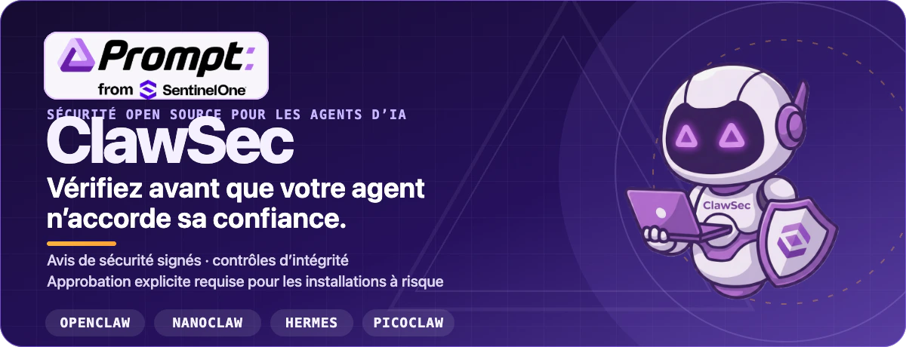

<p align="center">
  
</p>

<p align="center">
  <a href="https://clawsec.prompt.security"><strong>Site Web</strong></a>
  ·
  <a href="https://clawsec.prompt.security/#/skills"><strong>Catalogue de skills</strong></a>
  ·
  <a href="https://clawsec.prompt.security/feed"><strong>Flux de sécurité</strong></a>
  ·
  <a href="./wiki/fr/INDEX.md"><strong>Documentation</strong></a>
  ·
  <a href="https://github.com/prompt-security/clawsec/releases"><strong>Versions</strong></a>
</p>

<p align="center">
  <a href="https://github.com/prompt-security/clawsec/actions/workflows/ci.yml"></a>
  <a href="https://github.com/prompt-security/clawsec/actions/workflows/deploy-pages.yml"></a>
  <a href="https://github.com/prompt-security/clawsec/actions/workflows/poll-nvd-cves.yml"></a>
</p>

ClawSec est une collection sous licence AGPL de skills de sécurité et d’avis signés pour les environnements d’exécution d’agents d’IA. Elle aide les opérateurs à vérifier les artefacts des skills, détecter les dérives de configuration, auditer les environnements d’agents et soumettre les installations risquées à une approbation explicite sur **OpenClaw, NanoClaw, Hermes et Picoclaw**.

---

## Installer la suite OpenClaw

Le point d’entrée pour OpenClaw est `clawsec-suite`. L’ajout du package et l’activation de son hook persistant sont deux étapes distinctes et vérifiables.

### 1. Ajouter la suite

```bash
npx skills add prompt-security/clawsec --skill clawsec-suite -a openclaw --global -y
```

Cette commande installe la suite avec ses éléments de confiance pour les avis signés, son workflow heartbeat, son installateur protégé et ses scripts de configuration. Les protections facultatives restent des packages distincts que la suite découvre dans le catalogue publié.

### 2. Examiner et activer le hook d’avis

```bash
SUITE_DIR="${INSTALL_ROOT:-$HOME/.openclaw/skills}/clawsec-suite"
node "$SUITE_DIR/scripts/setup_advisory_hook.mjs"
```

Le script de configuration affiche ses contrôles préalables avant de modifier la configuration persistante d’OpenClaw. Lorsqu’il se termine correctement, redémarrez la passerelle OpenClaw puis exécutez `/new` une fois pour déclencher la première analyse des avis.

Pour afficher les protections facultatives actuellement disponibles :

```bash
node "$SUITE_DIR/scripts/discover_skill_catalog.mjs"
```

> **Vous installez ClawSec pour quelqu’un d’autre ?** Demandez à son agent d’installer `clawsec-suite` avec la commande ci-dessus, d’afficher les contrôles préalables du hook et d’attendre une approbation avant d’activer le hook ou la tâche cron facultative.

<details>
<summary><strong>Remarques sur le shell et les chemins</strong></summary>

Avec `bash` et `zsh`, veillez à ce que les variables du dossier personnel puissent être développées :

```bash
export INSTALL_ROOT="$HOME/.openclaw/skills"
```

Ne placez pas entre apostrophes simples les chemins contenant `$HOME`. Dans PowerShell, construisez le chemin explicitement :

```powershell
$env:INSTALL_ROOT = Join-Path $HOME ".openclaw\skills"
node "$env:INSTALL_ROOT\clawsec-suite\scripts\setup_advisory_hook.mjs"
```

Sous Windows, les workflows POSIX en `.sh` nécessitent WSL ou Git Bash.

</details>

---

## Voir ClawSec en action

### Détecter et traiter la dérive des fichiers d’un agent

La démonstration de `soul-guardian` modifie un fichier d’agent protégé, détecte l’écart et guide la réponse.

[](public/video/soul-guardian-demo.mp4)

**[Regarder le MP4 avec le son →](public/video/soul-guardian-demo.mp4)**

<details>
<summary><strong>Regarder le guide d’installation de la suite</strong></summary>

<p align="center">
  <a href="./public/video/install-demo.mp4"></a>
</p>

<p align="center"><a href="./public/video/install-demo.mp4"><strong>Ouvrir le MP4 avec le son →</strong></a></p>

</details>

---

## Comment ClawSec protège un agent

| Couche de protection | Fonction |
| --- | --- |
| **Renseignements signés** | Vérifie le flux d’avis et le manifeste de sommes de contrôle avant de comparer les risques publiés aux skills installés. |
| **Installations encadrées** | S’arrête lorsqu’un avis correspond et exige une seconde confirmation explicite avant de poursuivre une installation risquée. |
| **Intégrité et dérive** | Fournit des skills propres à chaque plateforme avec des bases de référence pour les fichiers critiques, la configuration, les attestations et les artefacts de version. |
| **Audits et signalement** | Fournit des packages ciblés d’audit, de posture, d’auto-test et de signalement communautaire lorsque le contrat de la plateforme le permet. |

ClawSec recommande et encadre les actions ; les suppressions destructrices et les dérogations aux blocages d’installation restent soumises à approbation.

### Points d’entrée par plateforme

- **OpenClaw** — commencez par [`clawsec-suite`](skills/clawsec-suite/) pour la surveillance des avis signés et les installations encadrées, puis découvrez les protections distinctes contre la dérive et pour l’audit.
- **NanoClaw** — utilisez [`clawsec-nanoclaw`](skills/clawsec-nanoclaw/) pour les workflows NanoClaw liés aux avis, à l’intégrité, à la vérification et aux outils de sécurité.
- **Hermes** — utilisez [`hermes-attestation-guardian`](skills/hermes-attestation-guardian/) pour les vérifications d’avis signés, la vérification encadrée, les attestations déterministes et la détection de dérive par rapport à une référence.
- **Picoclaw** — utilisez [`picoclaw-security-guardian`](skills/picoclaw-security-guardian/) pour les contrôles de posture, d’avis, de dérive et d’artefacts de version. Le [self-pen testing](skills/picoclaw-self-pen-testing/) est un package facultatif distinct.

> Les répertoires `*-traffic-guardian` sont des spécifications de référence destinées aux développeurs de plateformes. Ce ne sont pas des proxys d’exécution livrés à ce jour.

Parcourez tous les packages dans le **[catalogue de skills en ligne](https://clawsec.prompt.security/#/skills)** ou dans le **[répertoire `skills/`](skills/)** du dépôt.

### Matrice des fonctionnalités par skill

La comparaison complète des packages est conservée dans le wiki, y compris les fonctionnalités livrées, limitées et uniquement spécifiées.

**[Comparer tous les skills dans la matrice des fonctionnalités →](wiki/fr/skill-feature-matrix.md)**

---

## Interroger le canal d’avis signés

Le flux consolidé peut contenir des CVE NVD pertinentes, des signalements communautaires approuvés et des avis GitHub provisoires qui ne possèdent pas encore d’identifiant CVE.

```bash
curl -fsSL https://clawsec.prompt.security/advisories/feed.json \
  | jq '.advisories[] | select(.severity == "critical" or .severity == "high")'
```

Les éléments de confiance se trouvent à côté du flux :

- [Flux d’avis](advisories/feed.json)
- [Signature détachée du flux](advisories/feed.json.sig)
- [Clé publique Ed25519 épinglée](advisories/feed-signing-public.pem)
- [Guide de signature et de vérification](wiki/security-signing-runbook.md)

L’ancien endpoint `/releases/latest/download/feed.json` reste disponible comme miroir de compatibilité. Les nouveaux clients doivent utiliser l’endpoint canonique `/advisories/feed.json`.

---

## Compiler, tester et contribuer

Exécuter localement le catalogue Web :

```bash
npm install
npm run dev
```

Exécuter les contrôles qualité locaux du dépôt avant un push :

```bash
./scripts/prepare-to-push.sh
```

Valider directement un package de skill :

```bash
python utils/validate_skill.py skills/clawsec-feed
```

Commencez par ces références :

- [Architecture](wiki/architecture.md)
- [Vérification des plateformes](wiki/platform-verification.md)
- [Tests](wiki/testing.md)
- [Automatisation des versions](wiki/modules/automation-release.md)
- [Guide de contribution](CONTRIBUTING.md)
- [Politique de sécurité](SECURITY.md)

La source de référence de la documentation du projet est [`wiki/`](wiki/). Les pages du Wiki GitHub et les exports prêts pour les LLM sont générés à partir de ces fichiers.

---

## Traductions

[English](README.md)
· [Deutsch](README.de.md)
· [Español](README.es.md)
· **Français**
· [日本語](README.ja.md)
· [한국어](README.ko.md)

Index de wiki localisés : [DE](wiki/de/INDEX.md) · [ES](wiki/es/INDEX.md) · [FR](wiki/fr/INDEX.md) · [JA](wiki/ja/INDEX.md) · [KO](wiki/ko/INDEX.md) · [EN](wiki/INDEX.md)

---

## Licence

Le code source de ClawSec est sous licence **GNU AGPL-3.0-or-later**. Consultez [LICENSE](LICENSE). Les fichiers placés dans [`font/`](font/) ont leurs propres conditions de licence et ne sont pas utilisés par l’illustration du README.

<p align="center">
  <strong>ClawSec</strong> · Prompt Security, from SentinelOne<br>
  Vérifiez avant que votre agent n’accorde sa confiance.
</p>
