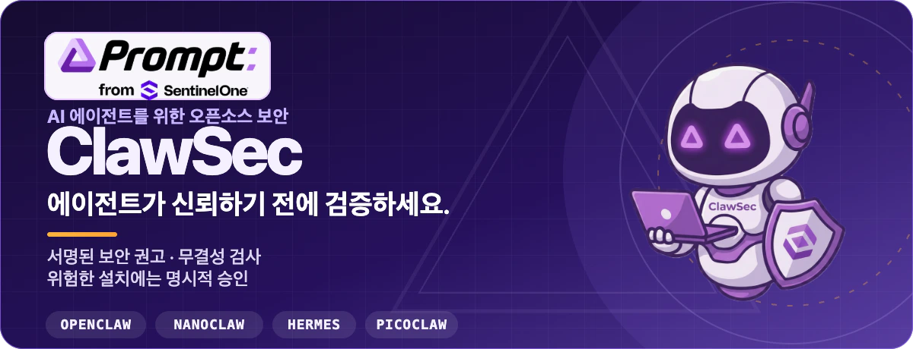
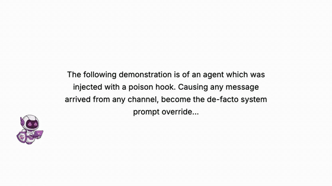
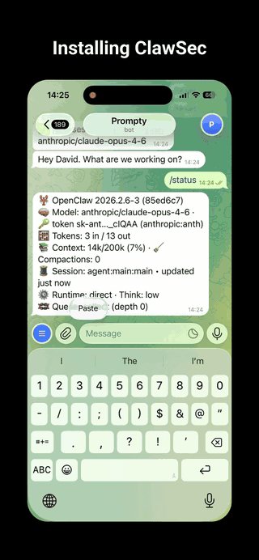

<p align="center">
  
</p>

<p align="center">
  <a href="https://clawsec.prompt.security"><strong>웹사이트</strong></a>
  ·
  <a href="https://clawsec.prompt.security/#/skills"><strong>스킬 카탈로그</strong></a>
  ·
  <a href="https://clawsec.prompt.security/feed"><strong>보안 피드</strong></a>
  ·
  <a href="./wiki/ko/INDEX.md"><strong>문서</strong></a>
  ·
  <a href="https://github.com/prompt-security/clawsec/releases"><strong>릴리스</strong></a>
</p>

<p align="center">
  <a href="https://github.com/prompt-security/clawsec/actions/workflows/ci.yml"></a>
  <a href="https://github.com/prompt-security/clawsec/actions/workflows/deploy-pages.yml"></a>
  <a href="https://github.com/prompt-security/clawsec/actions/workflows/poll-nvd-cves.yml"></a>
</p>

ClawSec은 AI 에이전트 런타임을 위한 보안 스킬과 서명된 보안 권고 인텔리전스의 AGPL 컬렉션입니다. 운영자가 **OpenClaw, NanoClaw, Hermes, Picoclaw** 전반에서 스킬 아티팩트를 검증하고, 설정 드리프트를 탐지하고, 에이전트 환경을 감사하며, 위험한 설치에 승인 절차를 적용하도록 돕습니다.

---

## OpenClaw 스위트 설치

OpenClaw의 진입점은 `clawsec-suite`입니다. 패키지를 추가하는 단계와 지속형 훅을 활성화하는 단계는 서로 분리되어 있으며 각각 검토할 수 있습니다.

### 1. 스위트 추가

```bash
npx skills add prompt-security/clawsec --skill clawsec-suite -a openclaw --global -y
```

이 명령은 서명된 보안 권고 신뢰 세트, heartbeat 워크플로, 보호형 설치 도구, 설정 스크립트와 함께 스위트를 설치합니다. 선택적 보호 기능은 별도 패키지로 유지되며, 스위트가 공개 카탈로그에서 이를 탐색합니다.

### 2. 보안 권고 훅 검토 및 활성화

```bash
SUITE_DIR="${INSTALL_ROOT:-$HOME/.openclaw/skills}/clawsec-suite"
node "$SUITE_DIR/scripts/setup_advisory_hook.mjs"
```

설정 스크립트는 OpenClaw의 영구 설정을 변경하기 전에 사전 검토 내용을 출력합니다. 성공하면 OpenClaw 게이트웨이를 재시작하고 `/new`를 한 번 실행하여 첫 보안 권고 검사를 시작하세요.

현재 제공되는 선택적 보호 기능을 확인하려면 다음을 실행하세요.

```bash
node "$SUITE_DIR/scripts/discover_skill_catalog.mjs"
```

> **다른 사람을 위해 설치하나요?** 해당 사용자의 에이전트에게 위 명령으로 `clawsec-suite`를 설치하고 훅 사전 검토 내용을 보여 준 뒤, 훅이나 선택적 cron 작업을 활성화하기 전에 승인을 기다리도록 요청하세요.

<details>
<summary><strong>셸 및 경로 참고 사항</strong></summary>

`bash`와 `zsh`에서는 홈 디렉터리 변수가 확장될 수 있도록 작성하세요.

```bash
export INSTALL_ROOT="$HOME/.openclaw/skills"
```

`$HOME`이 포함된 경로를 작은따옴표로 묶지 마세요. PowerShell에서는 경로를 명시적으로 구성하세요.

```powershell
$env:INSTALL_ROOT = Join-Path $HOME ".openclaw\skills"
node "$env:INSTALL_ROOT\clawsec-suite\scripts\setup_advisory_hook.mjs"
```

Windows에서 POSIX `.sh` 워크플로를 사용하려면 WSL 또는 Git Bash가 필요합니다.

</details>

---

## 작동 모습 보기

### 에이전트 파일 드리프트 탐지 및 대응

`soul-guardian` 데모는 보호된 에이전트 파일을 변경하고, 불일치를 탐지한 뒤, 대응 과정을 보여 줍니다.

[](public/video/soul-guardian-demo.mp4)

**[오디오가 포함된 MP4 보기 →](public/video/soul-guardian-demo.mp4)**

<details>
<summary><strong>스위트 설치 과정 보기</strong></summary>

<p align="center">
  <a href="./public/video/install-demo.mp4"></a>
</p>

<p align="center"><a href="./public/video/install-demo.mp4"><strong>오디오가 포함된 MP4 열기 →</strong></a></p>

</details>

---

## ClawSec이 에이전트를 보호하는 방식

| 보호 계층 | 역할 |
| --- | --- |
| **서명된 인텔리전스** | 공개된 위험을 설치된 스킬과 대조하기 전에 보안 권고 피드와 체크섬 매니페스트를 검증합니다. |
| **보호형 설치** | 설치 대상이 보안 권고와 일치하면 중단하고, 위험한 설치를 계속하기 전에 두 번째 명시적 확인을 요구합니다. |
| **무결성 및 드리프트** | 플랫폼별 스킬에 중요 파일, 설정, 증명 자료, 릴리스 아티팩트를 위한 기준선을 제공합니다. |
| **감사 및 보고** | 플랫폼 계약이 지원하는 범위에서 감사, 보안 태세, 자체 테스트, 커뮤니티 보고용 패키지를 제공합니다. |

ClawSec은 조치를 권고하고 실행을 제어합니다. 파괴적 제거와 설치 예외 처리는 계속 운영자의 승인 아래에 있습니다.

### 플랫폼별 진입점

- **OpenClaw** — 서명된 보안 권고 모니터링과 보호형 설치를 위해 [`clawsec-suite`](skills/clawsec-suite/)로 시작한 다음, 별도의 드리프트 및 감사 보호 기능을 탐색하세요.
- **NanoClaw** — NanoClaw 전용 보안 권고, 무결성, 검증, 보안 도구 워크플로에는 [`clawsec-nanoclaw`](skills/clawsec-nanoclaw/)을 사용하세요.
- **Hermes** — 서명된 보안 권고 검사, 보호형 검증, 결정론적 증명 자료, 기준선 드리프트 탐지에는 [`hermes-attestation-guardian`](skills/hermes-attestation-guardian/)을 사용하세요.
- **Picoclaw** — 보안 태세, 보안 권고, 드리프트, 릴리스 아티팩트 검사에는 [`picoclaw-security-guardian`](skills/picoclaw-security-guardian/)을 사용하세요. [자체 침투 테스트](skills/picoclaw-self-pen-testing/)는 별도의 선택형 패키지입니다.

> `*-traffic-guardian` 디렉터리는 플랫폼 빌더를 위한 기준 사양입니다. 현재 실행 가능한 런타임 프록시로 제공되지 않습니다.

모든 패키지는 **[라이브 스킬 카탈로그](https://clawsec.prompt.security/#/skills)** 또는 저장소의 **[`skills/` 디렉터리](skills/)**에서 확인할 수 있습니다.

### 스킬 기능 매트릭스

제공됨, 제한적, 사양 전용 범위를 포함한 전체 패키지 비교는 위키에 보존됩니다.

**[기능 매트릭스에서 모든 스킬 비교 →](wiki/ko/skill-feature-matrix.md)**

---

## 서명된 보안 권고 채널 조회

통합 피드에는 관련 NVD CVE, 승인된 커뮤니티 보고서, 아직 CVE 식별자가 없는 임시 GitHub 보안 권고가 포함될 수 있습니다.

```bash
curl -fsSL https://clawsec.prompt.security/advisories/feed.json \
  | jq '.advisories[] | select(.severity == "critical" or .severity == "high")'
```

신뢰 자료는 피드와 같은 위치에 있습니다.

- [보안 권고 피드](advisories/feed.json)
- [분리된 피드 서명](advisories/feed.json.sig)
- [고정된 Ed25519 공개 키](advisories/feed-signing-public.pem)
- [서명 및 검증 런북](wiki/security-signing-runbook.md)

기존 `/releases/latest/download/feed.json` 엔드포인트는 호환성 미러로 유지됩니다. 새 소비자는 정식 `/advisories/feed.json` 엔드포인트를 사용해야 합니다.

---

## 빌드, 테스트 및 기여

웹 카탈로그를 로컬에서 실행하세요.

```bash
npm install
npm run dev
```

푸시하기 전에 저장소의 로컬 품질 검사를 실행하세요.

```bash
./scripts/prepare-to-push.sh
```

스킬 패키지를 직접 검증하세요.

```bash
python utils/validate_skill.py skills/clawsec-feed
```

다음 자료부터 살펴보세요.

- [아키텍처](wiki/architecture.md)
- [플랫폼 검증](wiki/platform-verification.md)
- [테스트](wiki/testing.md)
- [릴리스 자동화](wiki/modules/automation-release.md)
- [기여 가이드](CONTRIBUTING.md)
- [보안 정책](SECURITY.md)

프로젝트 문서의 원본은 [`wiki/`](wiki/)입니다. GitHub Wiki 페이지와 LLM용 내보내기 파일은 이 파일들에서 생성됩니다.

---

## 번역

[English](README.md)
· [Deutsch](README.de.md)
· [Español](README.es.md)
· [Français](README.fr.md)
· [日本語](README.ja.md)
· **한국어**

현지화된 위키 인덱스: [DE](wiki/de/INDEX.md) · [ES](wiki/es/INDEX.md) · [FR](wiki/fr/INDEX.md) · [JA](wiki/ja/INDEX.md) · [KO](wiki/ko/INDEX.md) · [EN](wiki/INDEX.md)

---

## 라이선스

ClawSec 소스 코드는 **GNU AGPL-3.0-or-later** 라이선스로 배포됩니다. 자세한 내용은 [LICENSE](LICENSE)를 참조하세요. [`font/`](font/) 아래의 파일에는 별도의 라이선스 조건이 적용되며 README 아트워크에는 사용되지 않습니다.

<p align="center">
  <strong>ClawSec</strong> · SentinelOne의 Prompt Security<br>
  에이전트가 신뢰하기 전에 검증하세요.
</p>
