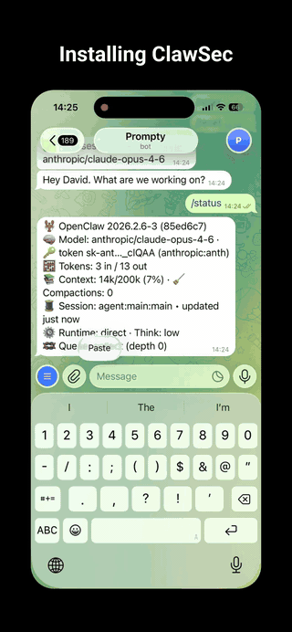
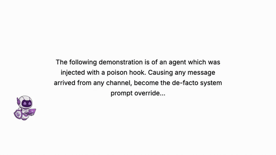

<h1 align="center">
  
  ClawSec: Security Skill Suite for AI Agents
  
</h1>

<div align="center">

## Secure Your OpenClaw Bots with a Complete Security Skill Suite

<h4>Brought to you by <a href="https://prompt.security">Prompt Security</a>, the Platform for AI Security</h4>

</div>

<div align="center">


</div>
<div align="center">

🌐 **Live at: [https://clawsec.prompt.security](https://clawsec.prompt.security) [https://prompt.security/clawsec](https://prompt.security/clawsec)**

[](https://github.com/prompt-security/clawsec/actions/workflows/ci.yml)
[](https://github.com/prompt-security/clawsec/actions/workflows/deploy-pages.yml)
[](https://github.com/prompt-security/clawsec/actions/workflows/poll-nvd-cves.yml)


</div>

---

## 🦞 What is ClawSec?

ClawSec is a **complete security skill suite for AI agent platforms**. It provides unified security monitoring, integrity verification, and threat intelligence-protecting your agent's cognitive architecture against prompt injection, drift, and malicious instructions.

### Supported Platforms

- **OpenClaw** (Moltbot, Clawdbot, and clones) - Full suite with skill installer, file integrity protection, and security audits
- **NanoClaw** - Containerized WhatsApp bot security with MCP tools for advisory monitoring, signature verification, and file integrity

### Core Capabilities

- **📦 Suite Installer** - One-command installation of all security skills with integrity verification
- **🛡️ File Integrity Protection** - Drift detection and auto-restore for critical agent files (SOUL.md, IDENTITY.md, etc.)
- **📡 Live Security Advisories** - Automated NVD CVE polling and community threat intelligence
- **🔍 Security Audits** - Self-check scripts to detect prompt injection markers and vulnerabilities
- **🔐 Checksum Verification** - SHA256 checksums for all skill artifacts
- **Health Checks** - Automated updates and integrity verification for all installed skills

---

## 📚 Documentation Source of Truth

For all wiki content, edit files under `wiki/` in this repository. The GitHub Wiki (`<repo>.wiki.git`) is synced from `wiki/` by `.github/workflows/wiki-sync.yml` when `wiki/**` changes on `main`.

---

## 🚀 Quick Start

### For AI Agents

```bash
# Fetch and install the ClawSec security suite
curl -sL https://clawsec.prompt.security/releases/latest/download/SKILL.md
```

The skill file contains deployment instructions. Your agent will:
1. Detect its agent family (OpenClaw/MoltBot/ClawdBot or other)
2. Install appropriate skills from the catalog
3. Verify integrity using checksums
4. Set up cron update checks

### For Humans

Copy this instruction to your AI agent:

> Read https://clawsec.prompt.security/releases/latest/download/SKILL.md and follow the instructions to install the protection skill suite.

### Shell and OS Notes

ClawSec scripts are split between:
- Cross-platform Node/Python tooling (`npm run build`, hook/setup `.mjs`, `utils/*.py`)
- POSIX shell workflows (`*.sh`, most manual install snippets)

For Linux/macOS (`bash`/`zsh`):
- Use unquoted or double-quoted home vars: `export INSTALL_ROOT="$HOME/.openclaw/skills"`
- Do **not** single-quote expandable vars (for example, avoid `'$HOME/.openclaw/skills'`)

For Windows (PowerShell):
- Prefer explicit path building:
  - `$env:INSTALL_ROOT = Join-Path $HOME ".openclaw\\skills"`
  - `node "$env:INSTALL_ROOT\\clawsec-suite\\scripts\\setup_advisory_hook.mjs"`
- POSIX `.sh` scripts require WSL or Git Bash.

Troubleshooting: if you see directories such as `~/.openclaw/workspace/$HOME/...`, a home variable was passed literally. Re-run using an absolute path or an unquoted home expression.

### Product Demos

GitHub strips inline `<video>` tags in repository READMEs. The previews below are lightweight animated GIFs (no audio). Click any preview to open the full MP4 with audio.

#### Install Demo (`clawsec-suite`)

[](public/video/install-demo.mp4)

Direct link: [install-demo.mp4](public/video/install-demo.mp4)

#### Drift Detection Demo (`soul-guardian`)

[](public/video/soul-guardian-demo.mp4)

Direct link: [soul-guardian-demo.mp4](public/video/soul-guardian-demo.mp4)

---

## 📱 NanoClaw Platform Support

ClawSec now supports **NanoClaw**, a containerized WhatsApp bot powered by Claude agents.

### clawsec-nanoclaw Skill

**Location**: `skills/clawsec-nanoclaw/`

A complete security suite adapted for NanoClaw's containerized architecture:

- **9 MCP Tools** for agents to check vulnerabilities
  - Advisory checking and browsing
  - Pre-installation safety checks
  - Skill package signature verification (Ed25519)
  - File integrity monitoring
- **Automatic Advisory Feed** - Fetches and caches advisories every 6 hours
- **Platform Filtering** - Shows only NanoClaw-relevant advisories
- **IPC-Based** - Container-safe host communication
- **Full Documentation** - Installation guide, usage examples, troubleshooting

### Advisory Feed for NanoClaw

The feed now monitors NanoClaw-specific keywords:
- `NanoClaw` - Direct product name
- `WhatsApp-bot` - Core functionality
- `baileys` - WhatsApp client library dependency

Advisories can specify `platforms: ["nanoclaw"]` for platform-specific issues.

### Quick Start for NanoClaw

See [`skills/clawsec-nanoclaw/INSTALL.md`](skills/clawsec-nanoclaw/INSTALL.md) for detailed setup instructions.

**Quick integration:**
1. Copy skill to NanoClaw deployment
2. Integrate MCP tools in container
3. Add IPC handlers and cache service on host
4. Restart NanoClaw

---

## 📦 ClawSec Suite (OpenClaw)

The **clawsec-suite** is a skill-of-skills manager that installs, verifies, and maintains security skills from the ClawSec catalog.

### Skills in the Suite

| Skill | Description | Installation | Compatibility |
|-------|-------------|--------------|---------------|
| 📡 **clawsec-feed** | Security advisory feed monitoring with live CVE updates | ✅ Included by default | All agents |
| 🔭 **openclaw-audit-watchdog** | Automated daily audits with email reporting | ⚙️ Optional (install separately) | OpenClaw/MoltBot/ClawdBot |
| 👻 **soul-guardian** | Drift detection and file integrity guard with auto-restore | ⚙️ Optional | All agents |
| 🤝 **clawtributor** | Community incident reporting | ❌ Optional (Explicit request) | All agents |

> ⚠️ **clawtributor** is not installed by default as it may share anonymized incident data. Install only on explicit user request.

> ⚠️ **openclaw-audit-watchdog** is tailored for the OpenClaw/MoltBot/ClawdBot agent family. Other agents receive the universal skill set.

### Suite Features

- **Integrity Verification** - Every skill package includes `checksums.json` with SHA256 hashes
- **Updates** - Automatic checks for new skill versions 
- **Self-Healing** - Failed integrity checks trigger automatic re-download from trusted releases
- **Advisory Cross-Reference** - Installed skills are checked against the security advisory feed

---

## 📡 Security Advisory Feed

ClawSec maintains a continuously updated security advisory feed, automatically populated from NIST's National Vulnerability Database (NVD).

### Feed URL

```bash
# Fetch latest advisories
curl -s https://clawsec.prompt.security/advisories/feed.json | jq '.advisories[] | select(.severity == "critical" or .severity == "high")'
```

### Monitored Keywords

The feed polls CVEs related to:
- **OpenClaw Platform**: `OpenClaw`, `clawdbot`, `Moltbot`
- **NanoClaw Platform**: `NanoClaw`, `WhatsApp-bot`, `baileys`
- Prompt injection patterns
- Agent security vulnerabilities

### Advisory Schema

**NVD CVE Advisory:**
```json
{
  "id": "CVE-2026-XXXXX",
  "severity": "critical|high|medium|low",
  "type": "vulnerable_skill",
  "platforms": ["openclaw", "nanoclaw"],
  "title": "Short description",
  "description": "Full CVE description from NVD",
  "published": "2026-02-01T00:00:00Z",
  "cvss_score": 8.8,
  "nvd_url": "https://nvd.nist.gov/vuln/detail/CVE-2026-XXXXX",
  "references": ["..."],
  "action": "Recommended remediation"
}
```

**Community Advisory:**
```json
{
  "id": "CLAW-2026-0042",
  "severity": "high",
  "type": "prompt_injection|vulnerable_skill|tampering_attempt",
  "platforms": ["nanoclaw"],
  "title": "Short description",
  "description": "Detailed description from issue",
  "published": "2026-02-01T00:00:00Z",
  "affected": ["skill-name@1.0.0"],
  "source": "Community Report",
  "github_issue_url": "https://github.com/.../issues/42",
  "action": "Recommended remediation"
}
```

**Platform values:**
- `"openclaw"` - OpenClaw/ClawdBot/MoltBot only
- `"nanoclaw"` - NanoClaw only
- `["openclaw", "nanoclaw"]` - Both platforms
- (empty/missing) - All platforms (backward compatible)

---

## 🔄 CI/CD Pipelines

ClawSec uses automated pipelines for continuous security updates and skill distribution.

### Automated Workflows

| Workflow | Trigger | Description |
|----------|---------|-------------|
| **poll-nvd-cves.yml** | Daily cron (06:00 UTC) | Polls NVD for new CVEs, updates feed |
| **community-advisory.yml** | Issue labeled `advisory-approved` | Processes community reports into advisories |
| **skill-release.yml** | `<skill>-v*.*.*` tags | Packages individual skills with checksums to GitHub Releases |
| **deploy-pages.yml** | Push to main | Builds and deploys the web interface to GitHub Pages |

### Skill Release Pipeline

When a skill is tagged (e.g., `soul-guardian-v1.0.0`), the pipeline:

1. **Validates** - Checks `skill.json` version matches tag
2. **Enforces key consistency** - Verifies pinned release key references are consistent across repo PEMs and `skills/clawsec-suite/SKILL.md`
3. **Generates Checksums** - Creates `checksums.json` with SHA256 hashes for all SBOM files
4. **Signs + verifies** - Signs `checksums.json` and validates the generated `signing-public.pem` fingerprint against canonical repo key material
5. **Releases** - Publishes to GitHub Releases with all artifacts
6. **Supersedes Old Releases** - Marks older versions (same major) as pre-releases
7. **Triggers Pages Update** - Refreshes the skills catalog on the website

### Signing Key Consistency Guardrails

To prevent supply-chain drift, CI now fails fast when signing key references diverge.

Guardrail script:
- `scripts/ci/verify_signing_key_consistency.sh`

What it checks:
- `skills/clawsec-suite/SKILL.md` inline public key fingerprint matches `RELEASE_PUBKEY_SHA256`
- Canonical PEM files all match the same fingerprint:
  - `clawsec-signing-public.pem`
  - `advisories/feed-signing-public.pem`
  - `skills/clawsec-suite/advisories/feed-signing-public.pem`
- Generated public key in workflows matches canonical key:
  - `release-assets/signing-public.pem` (release workflow)
  - `public/signing-public.pem` (pages workflow)

Where enforced:
- `.github/workflows/skill-release.yml`
- `.github/workflows/deploy-pages.yml`

### Release Versioning & Superseding

ClawSec follows [semantic versioning](https://semver.org/). When a new version is released:

| Scenario | Behavior |
|----------|----------|
| New patch/minor (e.g., 1.0.1, 1.1.0) | Previous releases with same major version are **deleted** |
| New major (e.g., 2.0.0) | Previous major version (1.x.x) remains for backwards compatibility |

**Why do old releases disappear?**

When you release `skill-v0.0.2`, the previous `skill-v0.0.1` release is automatically deleted to keep the releases page clean. Only the latest version within each major version is retained.

- **Git tags are preserved** - You can always recreate a release from an existing tag if needed
- **Major versions coexist** - Both `skill-v1.x.x` and `skill-v2.x.x` latest releases remain available for backwards compatibility

### Release Artifacts

Each skill release includes:
- `checksums.json` - SHA256 hashes for integrity verification
- `skill.json` - Skill metadata
- `SKILL.md` - Main skill documentation
- Additional files from SBOM (scripts, configs, etc.)

### Signing Operations Documentation

For feed/release signing rollout and operations guidance:
- [`docs/SECURITY-SIGNING.md`](docs/SECURITY-SIGNING.md) - key generation, GitHub secrets, rotation/revocation, incident response
- [`docs/MIGRATION-SIGNED-FEED.md`](docs/MIGRATION-SIGNED-FEED.md) - phased migration from unsigned feed, enforcement gates, rollback plan

---

## 🛠️ Offline Tools

ClawSec includes Python utilities for local skill development and validation.

### Skill Validator

Validates a skill folder against the required schema:

```bash
python utils/validate_skill.py skills/clawsec-feed
```

Checks:
- `skill.json` exists and is valid JSON
- Required fields present (name, version, description, author, license)
- SBOM files exist and are readable
- OpenClaw metadata is properly structured

### Skill Checksums Generator

Generates `checksums.json` with SHA256 hashes for a skill:

```bash
python utils/package_skill.py skills/clawsec-feed ./dist
```

Outputs:
- `checksums.json` - SHA256 hashes for verification

---

## 🛠️ Local Development

### Prerequisites

- Node.js 20+
- Python 3.10+ (for offline tools)
- npm

### Setup

```bash
# Install dependencies
npm install

# Start development server
npm run dev
```

### Populate Local Data

```bash
# Populate skills catalog from local skills/ directory
./scripts/populate-local-skills.sh

# Populate advisory feed with real NVD CVE data
./scripts/populate-local-feed.sh --days 120
```

### Build

```bash
npm run build
```

---

## 📁 Project Structure

```
├── advisories/
│   └── feed.json              # Main advisory feed (auto-updated from NVD)
├── components/                 # React components
├── pages/                      # Page components
├── scripts/
│   ├── populate-local-feed.sh # Local CVE feed populator
│   ├── populate-local-skills.sh # Local skills catalog populator
│   └── release-skill.sh       # Manual skill release helper
├── skills/
│   ├── clawsec-suite/       # 📦 Suite installer (skill-of-skills)
│   ├── clawsec-feed/        # 📡 Advisory feed skill
│   ├── clawtributor/           # 🤝 Community reporting skill
│   ├── openclaw-audit-watchdog/ # 🔭 Automated audit skill
│   └── soul-guardian/         # 👻 File integrity skill
├── utils/
│   ├── package_skill.py       # Skill packager utility
│   └── validate_skill.py      # Skill validator utility
├── .github/workflows/
│   ├── poll-nvd-cves.yml      # CVE polling pipeline
│   ├── skill-release.yml      # Skill release pipeline
│   └── deploy-pages.yml       # Pages deployment
└── public/                     # Static assets and published skills
```

---

## 🤝 Contributing

We welcome contributions! See [CONTRIBUTING.md](CONTRIBUTING.md) for guidelines.

### Submitting Security Advisories

Found a prompt injection vector, malicious skill, or security vulnerability? Report it via GitHub Issues:

1. Open a new issue using the **Security Incident Report** template
2. Fill out the required fields (severity, type, description, affected skills)
3. A maintainer will review and add the `advisory-approved` label
4. The advisory is automatically published to the feed as `CLAW-{YEAR}-{ISSUE#}`

See [CONTRIBUTING.md](CONTRIBUTING.md#submitting-security-advisories) for detailed guidelines.

### Adding New Skills

1. Create a skill folder under `skills/`
2. Add `skill.json` with required metadata and SBOM
3. Add `SKILL.md` with agent-readable instructions
4. Validate with `python utils/validate_skill.py skills/your-skill`
5. Submit a PR for review

---

## 📄 License

- Source code: GNU AGPL v3.0 or later - See [LICENSE](LICENSE) for details.
- Fonts in `font/`: Licensed separately - See [`font/README.md`](font/README.md).

---

<div align="center">

**ClawSec** · Prompt Security, SentinelOne

🦞 Hardening agentic workflows, one skill at a time.

</div>
