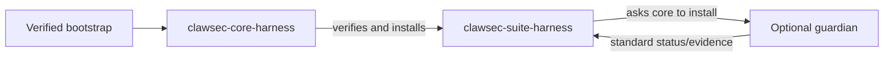
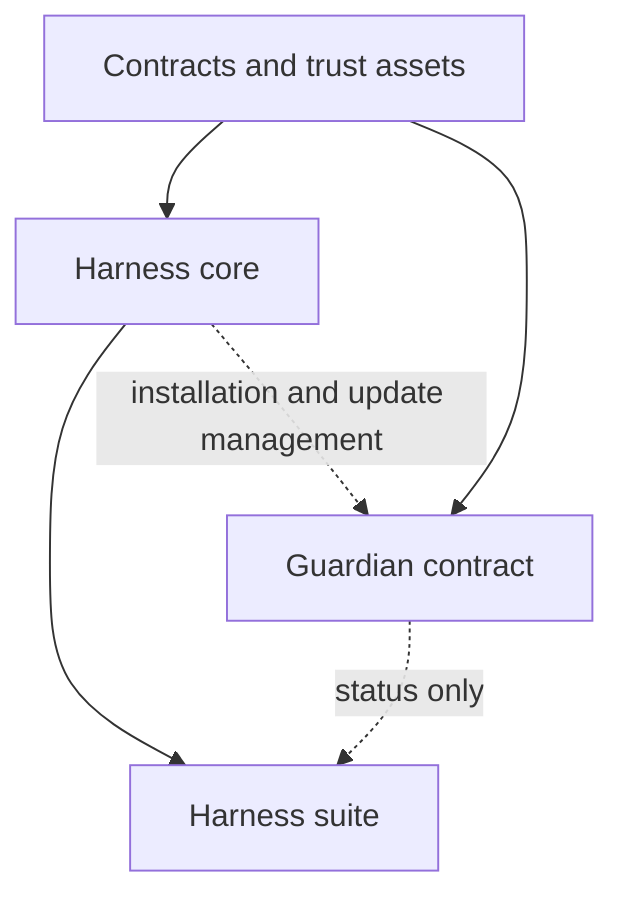
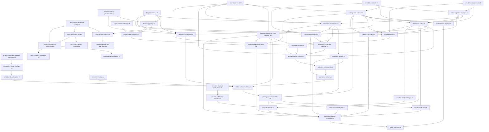
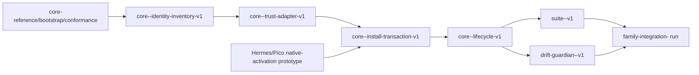

# ClawSec Multi-Harness Skill Architecture

## Document Status

- Status: Proposed working design
- Date: 2026-07-22
- Scope: OpenClaw, Hermes, NanoClaw, and PicoClaw
- Purpose: Guide this reorganization session and the follow-up implementation PRs
- Implementation state: No package in this document should be advertised as shipped until its conformance and harness acceptance tests pass

This document separates decisions that apply to every harness from integration work that must remain harness-specific. It is the working contract for future implementation agents. Changes to the decisions marked **required** need a focused architecture PR or an explicit update to this document before implementation proceeds.

---

## Executive Decision

ClawSec will use the same product flow on every supported harness:

```text
verified bootstrap
      -> harness core
      -> harness suite
      -> optional guardians
```

That flow does not mean one large skill and it does not mean identical code.

The target architecture has four layers:

| Layer | Responsibility | Packaging |
| --- | --- | --- |
| Trust assets and contracts | Signed advisories, signed release catalog, schemas, test vectors, result envelopes | Harness-agnostic, not an agent skill |
| Harness core | Verify trust assets, evaluate advisories, inventory installed skills, verify and install exact ClawSec artifacts | One installable core per harness |
| Harness suite | Discovery, status, recommendations, scheduling consent and planning, and optional guardian setup | One thin suite per harness |
| Guardians | Drift, traffic, audit, reputation, scanning, reporting, and other focused controls | Separate, reviewable skills |

The canonical package pattern is:

```text
clawsec-core-<harness>
clawsec-suite-<harness>
clawsec-<capability>-<harness>
```

Examples:

```text
clawsec-core-openclaw
clawsec-suite-openclaw
clawsec-drift-guardian-openclaw
clawsec-traffic-guardian-openclaw
```

The same pattern applies to `hermes`, `nanoclaw`, and `picoclaw`.

**Required:** `core` stays small. It must not absorb drift monitoring, traffic interception, automatic restoration, pen testing, or report delivery.

**Required:** `suite` is an orchestrator. It must not contain copies of core cryptography or guardian implementations.

**Required:** guardians remain independently reviewable and runnable. They must not import or execute suite implementation code.

---

## Why Reorganization Is Necessary

The current repository mixes harness, capability, maturity, and packaging concerns:

- `clawsec-suite` is an OpenClaw advisory engine, hook package, scheduler setup, installer wrapper, and catalog manager.
- `clawsec-nanoclaw` combines advisory checks, signature verification, MCP tools, integrity monitoring, and automatic response in one package.
- `hermes-attestation-guardian` combines core advisory trust with posture attestation and drift.
- `picoclaw-security-guardian` combines advisory handling, artifact verification, posture generation, and drift.
- `soul-guardian` is OpenClaw's closest drift guardian, but covers protected workspace files rather than a full harness posture.
- Four traffic guardian packages share a specification family but have only draft platform adapters.

This creates five concrete problems:

- Security-sensitive feed and signature code is duplicated and has diverged.
- The public capability matrix compares working, partial, and specification-only packages as if they were equivalent.
- Harness-specific behavior is hidden inside packages whose names do not expose their role.
- Installing a suite creates a large review surface even when an operator only wants signed advisories and verified ClawSec installation.
- A change to one capability can require reviewing unrelated runtime, persistence, or remediation behavior.

The current release path also has trust and reproducibility gaps that must be corrected before the split:

- The public `/skills/index.json` is discovery data, not a signed installation authority.
- The current guarded installer checks advisories and then asks `npx clawhub@latest` to resolve and download again, so it does not install verified bytes.
- Pages accepts some legacy unsigned releases and does not consistently bind every mirrored release key to the canonical allowed release key.
- Catalog selection depends on API ordering rather than an explicit stable channel and semantic-version rules.
- The release workflow deletes older releases within the same major version, which breaks durable receipts, rollback, and incident reconstruction.
- Version validation is inconsistent: the Python validator barely checks dotted fields, the shell release script rejects dot-separated prerelease identifiers, and the CI comparator implements fuller SemVer behavior. The lifecycle cannot start until one SemVer 2.0 parser and fixture set governs every path.

---

## Goals

- Give every harness the same understandable installation and management flow.
- Keep the security-critical trusted codebase small and reviewable.
- Use shared schemas and test vectors before attempting broad code reuse.
- Install the exact artifact bytes that were verified.
- Make harness and capability support machine-readable.
- Distinguish stable, experimental, draft, deprecated, and internal packages.
- Preserve current users through explicit compatibility packages and migrations.
- Let separate agents implement harness tracks without silently redefining common contracts.
- Generate the public capability matrix from validated metadata and conformance evidence.

---

## Non-Goals

- Building a universal third-party skill installer in the first version.
- Forcing every harness implementation into one programming language.
- Making every guardian available on every harness immediately.
- Enabling cron jobs, hooks, proxies, or restoration without explicit operator action.
- Renaming or deleting all legacy packages in one PR.
- Treating a signed artifact as safe merely because it was signed.
- Replacing harness-native security checks when they provide additional useful evidence.

The first core release secures installation of official ClawSec artifacts. Support for third-party publishers requires a separate trust-policy design.

---

## Terms and Roles

| Term | Meaning |
| --- | --- |
| Contract | Harness-neutral schema, behavior, status, or test-vector definition |
| Core engine | Pure verification, matching, catalog, receipt, and policy logic that does not call a harness API |
| Harness adapter | Code that locates harness state and invokes harness-native installation or lifecycle operations |
| Harness core | The installable combination of a conforming core engine and one harness adapter |
| Suite | Thin harness-specific orchestration and user experience layered on its harness core |
| Guardian | One focused security control with its own state, permissions, and lifecycle |
| Trust asset | Signed feed, catalog, root metadata, release manifest, key-rotation metadata, or checksum manifest |
| Verification receipt | Durable evidence identifying the exact artifact, signer, policy result, scope, and installation result |
| Posture evidence | Deterministic, non-secret state exported by a guardian for status or drift comparison |
| Compatibility package | A legacy package that delegates or directs users to the canonical package without duplicating new logic |

---

## Architecture Principles

### Separate user flow from dependency direction

The user flow is:



The dependency direction is different:



The core never depends on the suite or a guardian. The suite depends on a compatible core. A guardian can be installed through the suite, but its runtime must not depend on suite code.

The management graph is a star centered on the harness core. Suites and guardians may declare the compatible core management protocol used for installation, update, trust status, and receipts. That declaration is not automatically a runtime dependency. Removing a suite must not stop an already configured guardian, and removing a core must not silently break a guardian whose advertised runtime contract says it is standalone.

### Standardize behavior before sharing code

The first shared deliverables are schemas, fixtures, status envelopes, trust rules, and conformance tests.

Code should be shared only when runtime and security boundaries genuinely match. OpenClaw and the NanoClaw Node host may share JavaScript verification code; NanoClaw container code runs under Bun with a separate dependency and test tree. Hermes may prefer Python-native integration. PicoClaw should not gain a heavy runtime dependency merely to satisfy source-code reuse.

### Keep released skills self-contained

Monorepo source may use shared packages at build time. Every published skill archive must contain every ClawSec-owned runtime file it needs. It may call declared harness-native APIs and locations. A code-carrying installer such as NanoClaw may copy a bundled module or create a reviewed functional reach-in outside the skill directory only when that deterministic transformation is declared in the release manifest, tested, and bound into the installation receipt.

The release manifest and SBOM must identify bundled core and adapter files. Reproducible packaging tests must compare the built package with the declared manifest.

### Treat the core as the trusted computing base

The core makes cryptographic and installation decisions. Therefore it must have:

- Minimal dependencies.
- Deterministic, non-LLM verification paths.
- Fail-closed trust handling.
- No background persistence by default.
- No automatic remediation.
- Explicit installation scope.
- Structured results suitable for tests and wrappers.

### Prefer native integration without hiding side effects

Each suite and guardian should use the current harness-native hook and scheduling surfaces. Setup must show the exact files, jobs, hooks, services, or source changes before applying them.

---

## Target Product Layers

### Layer 0: Trust assets and contracts

This layer is harness-agnostic and is not installed as an agent skill.

It owns:

- Advisory schema and signed advisory feed.
- Signed official-skill catalog.
- Release manifest and archive digest schema.
- Root trust and key-rotation metadata.
- Signed release policy for lifecycle cutover, promotion approvers/workflow identities, thresholds, revocation, and receipt authorities.
- Private lab-catalog, candidate-build, deployment, qualification, promotion-authorization, promotion, channel-publication, catalog-activation, and migration record schemas.
- Post-activation family-integration receipt schema.
- Advisory application and semantic-version matching rules.
- Install receipt schema.
- Core result envelope and status vocabulary.
- Guardian status and posture evidence schemas.
- Conformance fixtures and malicious test archives.
- Capability names and maturity vocabulary.

It does not own:

- Harness paths.
- Config parsing.
- Hook registration.
- Scheduler creation.
- Service restart.
- Container or sandbox integration.

### Layer 1: `clawsec-core-<harness>`

Every harness core implements the same logical operations:

| Operation | Required behavior |
| --- | --- |
| `verify-feed` | Verify signature, checksum manifest, schema, and digest-bound verification state |
| `evaluate-advisories` | Match advisories against platform, component, application scope, and version |
| `inventory` | Return installed ClawSec and relevant harness components with scope and version evidence |
| `verify-release` | Verify signed catalog entry, release manifest, archive digest, package metadata, and safe archive structure |
| `install-release` | Install the exact verified bytes into an explicit harness scope and produce a receipt |
| `plan-release` | Return exact proposed writes, native operations, permissions, conflicts, and rollback steps without mutation |
| `update-release` | Resolve a signed exact update, verify it, preserve state compatibility, and apply through the same exact-byte transaction |
| `remove-release` | Produce and, after approval, execute a harness-native removal plan without deleting unrelated state |
| `verify-receipt` | Re-check that installed files still match a valid installation receipt |
| `doctor` | Report trust roots, state paths, adapter version, supported harness range, and degraded conditions |

These names describe the contract. A harness may expose them through a CLI, host service, code-carrying installation workflow, or another native transport.

The core must not:

- Install a mutable package name after verifying a different download.
- Trust a public key only because it was downloaded beside a signature.
- Treat a feed state string such as `verified` as proof without binding it to the exact feed digest.
- Enable hooks, recurring jobs, proxying, or file restoration automatically.
- Install arbitrary third-party packages in contract version 1.

### Layer 2: `clawsec-suite-<harness>`

Every suite provides the same logical user experience:

| Operation | Responsibility |
| --- | --- |
| `status` | Aggregate core health, advisory state, installed guardians, maturity, and last evidence timestamps |
| `catalog` | Display signed catalog entries applicable to the active harness and scope |
| `recommend` | Recommend optional controls without installing them |
| `install` | Ask the core to verify and install an exact official ClawSec artifact |
| `enable` | Review and configure a guardian's native runtime integration after installation |
| `disable` | Disable runtime integration without silently deleting state |
| `doctor` | Validate core compatibility, native integration, and guardian status contracts |

The suite owns consent and orchestration for recurring advisory setup because scheduling is harness-specific. It may call a small harness `SchedulePort` only when the harness exposes a suitable deterministic execution surface; it must not ship a hidden scheduler runtime or describe an LLM-driven task as deterministic verification. When no suitable native surface exists, the suite reports an explicit capability gap and remains on-demand until a separately reviewed host adapter exists. It invokes the core for feed verification and advisory evaluation instead of embedding another verifier.

The suite may offer profiles such as `baseline`, `recommended`, and `extended`, but profiles must remain transparent lists of independently installable skills. Selecting a profile must show side effects and request approval before each new persistent integration.

### Layer 3: Focused guardians

Guardian families include:

| Family | Common purpose | Required default |
| --- | --- | --- |
| Drift guardian | Generate posture evidence, authenticate a baseline, compare drift, and classify findings | Read-only alerting |
| Traffic guardian | Observe scoped runtime traffic and export redacted findings and monitor status | Detect and log |
| Audit guardian | Run periodic or on-demand security audits and report findings | On-demand |
| Reputation provider | Add non-cryptographic registry or scanner reputation evidence | Advisory only |
| Scanner | Dependency, SAST, configuration, or hook scanning | On-demand |
| Reporter | Prepare and explicitly submit incident reports | Local preparation only |

All guardians must provide a common status envelope. A guardian with automatic restore, blocking, quarantine, delivery, or network proxy behavior must expose that mode explicitly and keep it off by default.

Guardian evidence must derive package identity and version from validated build metadata. Hardcoded generator versions are forbidden, and conformance fails when the evidence producer, package manifest, and catalog identity disagree.

Target package lists reserve a consistent name; they do not claim that the capability exists. In particular, all traffic guardians remain outside the baseline profile until an implementation and harness acceptance tests exist.

---

## Common Trust and Installation Contract

### Trust domains

ClawSec should keep these trust domains distinct:

| Trust domain | Protects | Expected key policy |
| --- | --- | --- |
| Root metadata | Authorized signing keys and rotation | Pinned out of band; rotation authorized by an existing trusted root |
| Release catalog | Official skill identity, version, harness, release URL, and artifact digest | Catalog signer authorized by root metadata |
| Release manifest | Archive plus standalone package files | Release signer authorized by root metadata |
| Advisory feed | Advisory content and feed checksum manifest | Feed signer authorized by root metadata |
| Private lab candidate metadata | Candidate identity, lifecycle stage, exact payload, expiry, and lab policy | Separate lab root/key supplied explicitly by the operator; never authorized for public release or catalog signing |
| Promotion authorization | One exact candidate, qualification set, intended version, source commit, policy, and expiry | Threshold approvers or CI identity authorized by signed release policy rooted in production metadata; no payload-signing authority |
| Receipts and activation records | Evidence that bounded build, deploy, test, publication, and activation actions occurred | Signed CI/workflow identities authorized and revocable through release policy; evidence, not an alternative package trust root |

During a tightly scoped migration, explicitly approved production feed, catalog, and release domains may temporarily share one physical key, but schemas and code must not assume that. Lab, promotion-authorization, receipt, and activation identities never share private key material with production payload/catalog signers or with one another merely for convenience.

A promotion authorization is single-use for one durable `release_attempt_id`. It binds a unique authorization ID, candidate ID, current policy/root version, minimum active-catalog serial, exact input-receipt digests, expiry, and intended package/version. The promotion verifier records consumption before publication and rejects changed inputs, a revoked signer, an older policy/root, or use by another attempt. An idempotent rerun carrying the same authorization and attempt ID may only inspect, verify, and complete the exact matching release state; it cannot change bytes, refs, or destinations. A higher-serial signed release policy revokes or replaces approver and workflow identities without granting them package-signing authority.

The signed catalog is separate from the existing UI index. `clawsec.catalog/v2` must include:

- Monotonic serial and expiry.
- An explicit public `stable` channel. Beta, release-candidate, and stable-intent qualification data live only in a separate private lab catalog and never appear in public discovery.
- Exact name, version, tag, manifest digest, archive digest, and signer key ID.
- Harness, role, maturity, capabilities, protocol compatibility, and dependencies.
- Replacements, conflicts, aliases, and yanked releases with reasons.
- Canonical release URLs that remain immutable.

Aliases are discovery aids, not silent identity substitution. Installing an old package ID resolves its own signed compatibility package. A bad release is rolled back by publishing a higher-serial catalog that yanks it and points the channel to an earlier immutable release; tags and assets are not rewritten or deleted.

### Bootstrap

The initial core cannot establish trust in itself merely by downloading a key beside its own signature.

The supported bootstrap must:

- Publish the root fingerprint through an out-of-band repository or product channel.
- Download the core release manifest, signature, signer certificate or public key, and exact archive.
- Validate the signer against the pinned root fingerprint or root metadata.
- Verify the exact archive and package files.
- Install only after verification succeeds.
- Record the bootstrap receipt.

Harness-native verification, such as an OpenClaw or registry trust envelope, is useful additional evidence. It does not replace ClawSec's exact release verification unless the accepted trust model explicitly says so.

### Exact-byte installation

The required transaction is:

```text
resolve signed catalog entry
        -> download one immutable artifact
        -> verify signer and manifest
        -> verify archive digest and safe paths
        -> evaluate advisories
        -> stage exact verified contents
        -> invoke native install on staged contents, if needed
        -> validate installed contents
        -> atomically commit or report rollback instructions
        -> write verification receipt
```

The installer must not verify one archive and then invoke a native command that re-resolves the skill by mutable name or `latest` tag.

### Verification receipt

`clawsec.install-receipt/v1` must include at least:

- Skill name and exact version.
- Harness and installation scope.
- Catalog digest and signer fingerprint.
- Release-manifest digest and signer fingerprint.
- Archive digest.
- Installed-file digest set or verified package digest.
- Advisory feed digest used for the decision.
- Policy result and any explicit override.
- Core and adapter versions.
- Installation time and target path or harness identifier.

Receipts must not contain secrets. Paths should be normalized without exposing unrelated home-directory content in reports.

### Advisory verification state

`clawsec.advisory-state/v1` must bind status to:

- Exact feed SHA-256 digest.
- Feed schema version.
- Signature and signer fingerprint.
- Checksum-manifest digest and signature result.
- Verification timestamp.
- Source URL or local source identifier.
- Last successful refresh and current freshness policy.

Consumers must recompute or validate this binding before trusting a cached feed.

### Result envelope

Every core, suite, and guardian operation must return a structured `clawsec.result/v1` envelope containing:

- Operation.
- Component and version.
- Harness and scope.
- Outcome: `pass`, `finding`, `confirmation_required`, `blocked`, `degraded`, `unsupported`, `not_applicable`, or `error`.
- Stable machine-readable reason codes.
- Human-readable summary.
- Evidence digests and receipt references.
- Side effects applied or proposed.

`intentionally_unsupported` is a stable reason code used with outcome `unsupported`; it is not a separate outcome. Exit code `42` is only the CLI mapping for `confirmation_required` and remains reserved for an explicit second confirmation to preserve current guarded-install behavior. A foundation PR must define the rest of the exit-code registry; adapter PRs must not invent conflicting codes.

---

## Capability and Metadata Contract

Every installable skill keeps the current top-level platform metadata for catalog compatibility and adds a normalized `clawsec` object.

Proposed shape:

```json
{
  "name": "clawsec-drift-guardian-openclaw",
  "version": "1.0.0",
  "platform": "openclaw",
  "clawsec": {
    "contract_version": "1",
    "role": "guardian",
    "family": "drift",
    "maturity": "experimental",
    "provides": [
      "posture.snapshot",
      "posture.verify",
      "posture.diff"
    ],
    "management_protocol_requires": [
      {
        "role": "core",
        "harness": "openclaw",
        "contract": "^1"
      }
    ],
    "install_requires": [],
    "runtime_requires": [],
    "legacy_names": ["soul-guardian"],
    "default_mode": "read-only"
  }
}
```

Dependency metadata separates three questions:

| Field | Meaning |
| --- | --- |
| `management_protocol_requires` | Protocol used for catalog, installation, update, status, or receipts |
| `install_requires` | Packages that must exist for installation to complete |
| `runtime_requires` | Packages that must remain installed and available while this package runs |

A suite normally has a core runtime dependency because it delegates trust and installation operations to the core. A guardian should normally have only management-protocol compatibility and no suite or core runtime dependency. Exceptions require an explicit capability and failure-mode justification.

Every built NanoClaw artifact must also declare exactly one validated `clawsec.native` profile: `category` (`utility`, `operational`, or `container` for the initial ClawSec set), normalized install location, whether apply leaves state, whether `REMOVE.md` is required, and the host component responsible for installation and removal. A source template may leave the suite choice open, but a candidate manifest cannot; changing the selected category or persistence profile changes package metadata and invalidates qualification.

The allowed maturity values are:

| Maturity | Meaning |
| --- | --- |
| `draft` | Specification or placeholder; not a shipped protection |
| `experimental` | Implemented and tested, but compatibility or operational behavior may still change |
| `stable` | Meets core contracts, harness acceptance tests, release checks, and documented support range |
| `deprecated` | Supported only for migration; points to a canonical successor |
| `internal` | Maintainer tooling; excluded from the end-user security catalog |

Capability maturity is not the release lifecycle. `maturity` describes what the package can safely claim; `beta`, `rc`, `stable_intent`, and `stable` describe private qualification or publication state. Candidate lifecycle state appears only in private receipts and the private lab catalog. The initial public stable channel accepts `maturity: stable` packages and signed `maturity: deprecated` compatibility packages. Draft, experimental, or internal maturity packages and beta/RC artifacts remain outside public store and discovery projections. Stable-intent identity and private evidence also remain private; only its identical final-version payload may be published after promotion verification.

The catalog and README capability matrix must be generated from validated metadata plus conformance results. A declared capability without passing evidence may be displayed as planned, but not as available.

---

## Harness-Agnostic Versus Harness-Specific Boundary

Use this decision rule:

> If an operation can be expressed entirely in terms of signed bytes, normalized metadata, deterministic schemas, and provided inventory records, it belongs in the common contract or engine. If it must discover or mutate harness-native state, it belongs in a harness adapter, suite, or guardian.

| Harness-agnostic | Harness-specific |
| --- | --- |
| Ed25519 and checksum verification behavior | Skill and config discovery paths |
| Canonical JSON and digest rules | Workspace, profile, global, or checkout scope |
| Advisory schema and semantic-version matching | Native inventory collection |
| Signed catalog and release-manifest validation | Hook, plugin, or MCP registration |
| Safe archive policy and malicious fixtures | Native scheduling and task management |
| Install and verification receipt schemas | Restart and reload behavior |
| Capability and maturity vocabulary | Container, sandbox, and IPC or database boundaries |
| Guardian status and posture envelopes | Native notifications and delivery |
| Conformance tests and test vectors | Native uninstall and source rollback |

Common code is optional. Common behavior is required.

### Adapter port model

Harness integration is divided into small ports so one giant adapter does not become another suite monolith:

| Port | Owner | Responsibility |
| --- | --- | --- |
| `IdentityPort` | Core | Detect harness version, active profile/home/checkout, and supported scope |
| `InventoryPort` | Core | Enumerate installed components with identity, version, origin, and digest evidence |
| `InstallPort` | Core | Plan, stage, activate, post-verify, remove, and describe rollback for exact local bytes |
| `SchedulePort` | Suite | Plan, list, create, pause, and remove native recurring advisory jobs after consent, or report unsupported when the native scheduler cannot execute the deterministic core operation |
| `EventPort` | Suite or guardian | Emit normalized findings and status through a supported native surface |
| `PosturePort` | Drift guardian | Collect harness-native posture fields without secret values |

Ports are logical interfaces. They may be functions, CLIs, plugins, host services, or installation workflows. A port must return the common result envelope and must not absorb another layer's policy.

---

## Per-Harness Target Design

### OpenClaw

Target packages:

```text
clawsec-core-openclaw
clawsec-suite-openclaw
clawsec-drift-guardian-openclaw
clawsec-traffic-guardian-openclaw
clawsec-audit-watchdog-openclaw
clawsec-reputation-openclaw
```

Core adapter responsibilities:

- Resolve workspace, project-agent, personal-agent, managed, and explicitly selected installation scopes.
- Inventory installed skills with origin and version evidence.
- Use OpenClaw's native trust envelope as additional evidence where available.
- Provide a trusted core policy executable outside agent-writable workspace and skill roots.
- Accept OpenClaw's already-staged source material through the `security.installPolicy` protocol and return a fail-closed allow/block decision.
- Install a staged, already-verified local skill directory rather than re-resolving a mutable registry name.
- Preserve scope in receipts and avoid silently switching from workspace to global installation.

Suite responsibilities:

- Replace the current mixed `clawsec-suite` implementation with a thin OpenClaw catalog and status layer.
- Offer an explicit reviewed setup step that configures `security.installPolicy` to call the core executable.
- Use an OpenClaw internal hook for lightweight advisory notification events.
- Use typed plugin hooks only when ordered or blocking lifecycle enforcement is necessary.
- Use native OpenClaw cron for explicitly approved recurring advisory checks.
- Delegate all signature, feed, advisory, and exact-artifact decisions to the core.

Drift guardian migration:

- Start from `soul-guardian` file integrity and audit behavior.
- Add a deterministic OpenClaw posture envelope covering selected config, skill roots, hooks, plugins, schedules, and protected workspace files.
- Treat existing local snapshots as unauthenticated migration evidence. Import them only in dry-run, require operator re-authorization, and write a signed, MACed, or externally digest-bound canonical baseline.
- Change the target default to read-only findings; restoration remains a separately enabled response mode.
- Keep automatic restoration as an explicit optional response mode.
- Preserve existing baselines and audit data through a documented migration tool.

Current OpenClaw documentation distinguishes instruction skills, internal hooks, and typed plugin hooks. The implementation PR must choose the least privileged native surface for each operation instead of treating all three as interchangeable.

### Hermes

Target packages:

```text
clawsec-core-hermes
clawsec-suite-hermes
clawsec-drift-guardian-hermes
clawsec-traffic-guardian-hermes
```

Core adapter responsibilities:

- Resolve the active Hermes profile rather than assuming one global home.
- Read current `config.yaml` and profile-specific skills/state without reading secret values from `.env`.
- Inventory skills, plugins, hooks, and relevant harness version evidence.
- Install exact verified skill contents into the selected profile scope.
- Preserve profile identity in receipts and state.
- Treat Hermes external skill directories as mutable inventory locations, not as a write-protection boundary.

Suite responsibilities:

- Use Hermes-native cron rather than editing user crontab directly.
- Use gateway, plugin, or shell hooks according to whether the integration is gateway-only, cross-runtime, observational, or blocking.
- Respect Hermes hook consent and non-interactive execution rules.
- Aggregate core and guardian evidence per profile.

Drift guardian migration:

- Retain the deterministic attestation, schema verification, authenticated baseline, and severity diff strengths of `hermes-attestation-guardian`.
- Remove advisory feed and candidate-install logic after the Hermes core owns it.
- Update posture coverage for current config, profiles, gateways, plugins, hooks, toolsets, MCP, scheduling, API exposure, and terminal backend.
- Keep the guardian read-only by default.

### NanoClaw

Target packages:

```text
clawsec-core-nanoclaw
clawsec-suite-nanoclaw
clawsec-drift-guardian-nanoclaw
clawsec-traffic-guardian-nanoclaw
```

NanoClaw requires the largest adapter difference. The official skill overview describes the v2 model as of v2.1.4, while the repository's actual public refs currently advance through `v2.1.17`. This design was source-checked against tag `v2.1.17` at commit `ee7f891698760f21b9e79a850d64c7f633cd95ef`; that evidence is not a blanket support range. Each implementation PR must declare and test its exact supported v2 range.

NanoClaw v2 uses a Node.js host, one container per active session, and two SQLite session files as its host/container IPC: the host writes `inbound.db`, the container writes `outbound.db`, and both sides poll. Per-session databases are isolated, but sessions in one agent group share the group's writable workspace, memory, instructions, container configuration, selected skills, mounts, and credential scope; full separation requires different agent groups. The retired behavior is the v1 message-file IPC under `/workspace/ipc`, not filesystem IPC in general.

The adapter must distinguish three privilege surfaces:

- The apply-time coding harness executes privileged, unsandboxed `SKILL.md` workflows under `.claude/skills/` in the checkout. These workflows have no `manifest.yaml` or skill-state file and install additively rather than merging `skill/*` branches.
- The NanoClaw Node host owns central state, routing, container lifecycle, the `ncl` Unix-socket admin API, and any persistent ClawSec host module.
- The Bun agent container is untrusted for ClawSec control decisions and receives at most a narrow read-only evidence surface.

NanoClaw package categories are explicit:

| ClawSec package | NanoClaw category and location | Persistence and removal | Upstream lane |
| --- | --- | --- | --- |
| Core | Host utility/install workflow at `.claude/skills/clawsec-core-nanoclaw/` | Carries deterministic host code and leaves managed state; `REMOVE.md` required | NanoClaw `main`, if later proposed upstream |
| Suite | Host operational workflow when instruction-only; host utility when it installs code or state, under `.claude/skills/clawsec-suite-nanoclaw/` | `REMOVE.md` required whenever apply leaves state | NanoClaw `main`, if later proposed upstream |
| Drift guardian | Host utility at `.claude/skills/clawsec-drift-guardian-nanoclaw/` with host-owned runtime | Read-only by default but stateful baseline/setup still requires `REMOVE.md` | NanoClaw `main`, if later proposed upstream |
| Traffic guardian | Draft host utility at `.claude/skills/clawsec-traffic-guardian-nanoclaw/` | No release until the v2 host boundary is implemented; `REMOVE.md` required if stateful | NanoClaw `main`, only after acceptance |
| Optional agent status view | Separate read-only container skill under `container/skills/` | No trust, installation, raw-receipt, or remediation authority | NanoClaw `main`, only as an independently reviewed contribution |

The table describes allowed designs, not unresolved release metadata. Each built suite selects exactly one native category in its candidate manifest. The optional agent status view is upstream-only in the initial release; ClawSec does not copy it into `container/skills/` or alter group selection until a separate host-owned install/remove transaction is designed and accepted.

ClawSec does not use NanoClaw's `channels` or `providers` branch lanes unless a future package really implements that adapter type. A product name or distribution need is not enough to put security code in those branches.

Core adapter responsibilities:

- Run verification, source installation, receipt creation, and remediation authority on the host side, never in an agent container.
- Use one NanoClaw activation transaction in lab and production, parameterized only by authority: an explicit private lab root/candidate manifest for qualification, or the pinned production root/active stable catalog for users. The transaction verifies and safe-extracts in quarantine, checks preimages and conflicts, atomically places the exact skill tree, writes a staging/attempt record, invokes the pinned coding harness for approved apply steps, runs build/tests and postimage validation, commits the result, and only then writes `clawsec.install-receipt/v1`. It never falls back to `npx skills`, `gh skill`, a mutable Git ref, or raw copying.
- Package `clawsec-core-nanoclaw` as a NanoClaw utility/install workflow under `.claude/skills/`, bundling all ClawSec-owned runtime files and using idempotent apply steps. Declared NanoClaw host APIs, copied bundled modules, and tested source reach-ins are allowed only as receipt-bound transformations.
- Keep `SKILL.md` limited to apply and operator-facing orchestration. Put complete removal mechanics in `REMOVE.md`. All signature, catalog, advisory, safe-archive, install-tree, policy, and receipt decisions execute in a bundled deterministic host CLI or library; the coding harness cannot select trust keys or payload bytes or reinterpret allow/block results.
- Verify the signed ClawSec install tree before applying it. Do not fetch NanoClaw's `channels` or `providers` registry branches unless a future upstream-accepted integration actually belongs to one of those categories.
- Prefer self-contained files carried by the ClawSec skill. Use optional `nc:` directive fences only where their deterministic behavior matches the complete adjacent prose.
- Pin every added dependency exactly, minimize edits to existing NanoClaw files, and add a failing test for every functional reach-in.
- Run `pnpm run build`, the host tests affected by the change, and the dedicated skill test configuration after apply and removal.
- Record every created or modified path, its preimage when relevant, and its resulting digest in the installation receipt.
- Do not require an entirely clean customized checkout. Refuse unattended writes when an intended target or integration point has an unexpected preimage or conflicting uncommitted edit; produce an explicit conflict plan without touching unrelated changes.
- Inventory the checkout revision and conflict state, package manifest and exact lockfile, ClawSec-created paths and functional reach-ins, `.claude/skills/`, selected read-only container skills, service state, and only ClawSec-owned task metadata from receipt-recorded series IDs: group, status, process time, and recurrence. “Owned” means the series ID is bound by a ClawSec receipt; NanoClaw has no native ownership-marker field. Never retain task prompts, scripts, run logs, broad `ncl --json` output, or another group's task records. If a later reminder feature must detect content mutation, it may transiently read only a receipt-owned task, compare a keyed digest to the approved expected value, discard the raw value immediately, and export/store only the digest result. For databases, record only schema, owner, mode, and one-writer invariants; never inspect unrelated message rows, hash raw databases, or enumerate another session's content.
- Never revive the old `/workspace/ipc` message-file or `registered_groups.json` assumptions. Preserve the v2 SQLite ownership rules and never inspect message contents as security posture.

Suite responsibilities:

- Make the primary NanoClaw suite experience an operator-run host workflow that consumes core structured output. Use `ncl` over the protected Unix socket as the supported live administration input; do not couple ordinary suite behavior directly to SQLite tables or treat either surface as a new trust root.
- Treat deterministic recurring verification as an explicit gap in the initial ClawSec suite release. `ncl tasks` schedules prompts in isolated agent sessions and an optional task script runs inside the container, so it must not run the trusted core or be advertised as a host security scheduler.
- If `ncl tasks` is later offered for reminders or summaries of already verified evidence, show the exact agent group, prompt, recurrence, container wake-up and model-call cost, and require ClawSec consent before the command. Task verbs are `open`, not approval-gated, for callers permitted to access the resource; host-issued commands also execute immediately.
- Add a recurring verification option only through a separately reviewed host adapter that can execute the deterministic core outside the container. Until then, report scheduling as unsupported and keep verification on-demand.
- Do not install a container skill by default. A future container status skill may expose only schema-limited, read-only, precomputed evidence through an explicit mount or tool.
- Keep signing keys, installation authority, raw receipts, message data, and remediation authority out of the agent container.

NanoClaw removal is also host-owned. For suite and guardians, the core verifies the removal plan, executes and validates `REMOVE.md` while the workflow still exists, removes the package directory last, and appends a removal/tombstone receipt. Core self-removal is finalized by a separately staged and verified standalone remover: it executes and validates the core's `REMOVE.md`, removes the core directory last, and records completion outside that directory. Interrupted and repeated removal resume idempotently from the attempt record. Operational state is reversed, but append-only build, install, apply-attempt, migration, and removal evidence is preserved.

Drift guardian migration:

- Reuse only the legacy hashing, symlink refusal, finding classification, and test-fixture ideas from `clawsec-nanoclaw`; do not preserve its container/agent authority model.
- Redesign posture around the v2 host source and dependency lock, central configuration schema, module registration points, `ncl.sock` permissions, mount allowlist, egress policy, group-shared writable workspace, read-only `/app/src` and `/app/skills`, nested read-only `container.json` and composed `CLAUDE.md`, container image/config, service definition, and the restricted ClawSec-owned task metadata above.
- Treat `data/v2.db`, `inbound.db`, and `outbound.db` as live state with potentially sensitive content. Collect only normalized schema, ownership, permission, and invariant evidence; never baseline raw database bytes or messages.
- Treat every legacy NanoClaw baseline and audit chain as unauthenticated migration evidence. Require fresh host-side operator enrollment into an authenticated baseline.
- Defer agent approval, restoration, and quarantine to a separate host-owned response-mode PR after read-only drift is stable.
- Do not expose arbitrary host paths, SQLite write access, or source/remediation authority through a container tool.

The observable product flow remains core, suite, and optional guardian. The package mechanics are intentionally different from OpenClaw, Hermes, and PicoClaw, and deterministic recurring verification remains visibly unavailable until the host-side gap is solved.

### PicoClaw

Target packages:

```text
clawsec-core-picoclaw
clawsec-suite-picoclaw
clawsec-drift-guardian-picoclaw
clawsec-traffic-guardian-picoclaw
clawsec-posture-review-picoclaw
```

Core adapter responsibilities:

- Resolve `PICOCLAW_HOME`, `PICOCLAW_CONFIG`, workspace skill roots, and global skill roots explicitly.
- Understand current config schema versions and record the detected version.
- Inventory skills and relevant gateway/config state without collecting secrets.
- Replace the current unbound feed-state trust with direct feed verification and digest-bound state.
- Enforce pinned ClawSec signer identity for official skill artifacts.

Suite responsibilities:

- Provide the common catalog and status experience with a lightweight implementation.
- Use PicoClaw heartbeat or native task tooling only after explicit review.
- Use a PicoClaw process hook only when synchronous observation or enforcement is required; keep on-demand suite operations as ordinary skill/CLI calls.
- Avoid introducing Node or another heavy runtime dependency solely for code-sharing if a smaller native implementation is practical.

Drift guardian migration:

- Retain useful profile and diff behavior from `picoclaw-security-guardian`.
- Remove advisory and artifact-verification logic after the PicoClaw core owns it.
- Validate profile schema and canonical digest.
- Require an authenticated baseline rather than trusting an editable local JSON baseline.
- Cover current config, security overlay presence without secret values, gateway exposure, skills, MCP, cron/heartbeat, workspace restriction, and monitored component status.

---

## Capability Parity and Explicit Gaps

Parity means the same contract and user-visible outcome where the harness can safely provide it. It does not mean identical files, runtimes, schedulers, or privileges.

| Capability | OpenClaw | Hermes | NanoClaw v2 | PicoClaw |
| --- | --- | --- | --- | --- |
| All ten core operations from `verify-feed` through `doctor` | Required | Required | Required through deterministic host CLI plus apply/remove workflow | Required |
| Suite `status`, `catalog`, `recommend`, exact-install delegation, and `doctor` | Required | Required | Required as operator-run host workflow | Required |
| Guardian `enable` and `disable` | Conditional on persistent native integration | Conditional on persistent native integration | Conditional; on-demand operation is valid | Conditional on persistent native integration |
| Deterministic recurring advisory verification | Conditional through reviewed native cron | Conditional through reviewed Hermes scheduler | Intentionally unsupported in the initial ClawSec NanoClaw v2 suite release until a host adapter exists | Planned; heartbeat/task behavior must pass a prototype gate |
| Separate authenticated, read-only drift guardian | Required before the harness family is declared complete | Required before the harness family is declared complete | Required through a v2 host-owned rewrite | Required before the harness family is declared complete |
| Traffic guardian | Planned, outside baseline | Planned, outside baseline | Planned, outside baseline and requires a v2 redesign | Planned, outside baseline |
| Agent/container status surface | Optional | Optional | Optional distinct read-only container payload; never trust or install authority | Optional |

Maturity rules make the matrix enforceable:

- A stable core implements and passes all ten Layer 1 operations. There is no partial stable core.
- A stable suite implements the common on-demand operations. Persistence-specific operations may be `not_applicable` or `unsupported` only with a machine-readable reason and no misleading setup command.
- A stable drift guardian has an authenticated baseline, deterministic posture and diff behavior, read-only default, and the common status envelope.
- `intentionally_unsupported` is an honest capability result, not a failure of the common product flow. It must remain visible in `status`, generated matrices, and acceptance evidence.
- Optional asymmetric packages such as OpenClaw audit/reputation or PicoClaw posture review are product additions, not missing parity in the other harnesses.

### Current-source gap assessment

The existing four bundles are migration inputs, not four conforming implementations:

| Area | OpenClaw `clawsec-suite` | `hermes-attestation-guardian` | `clawsec-nanoclaw` | `picoclaw-security-guardian` |
| --- | --- | --- | --- | --- |
| Feed and advisory behavior | Broadest working fragments, but checksum and exact-install trust need hardening | Strongest fail-closed feed implementation; profile/config discovery is stale | Useful verification and semver fixtures, but duplicated v1 integration | Weak partial flow trusts caller-supplied verification state |
| Inventory and exact install | Partial single-root inventory; current guarded install re-resolves a mutable package | Missing inventory and exact install | Wrong v1 container inventory and no exact install | Posture scan is not an installed-skill inventory; no exact install |
| Catalog, receipts, update/remove, doctor | Missing signed authority and common operations | Missing | Missing | Missing |
| Suite orchestration | Partial discovery and setup, without a common envelope or symmetric disable | Missing as a suite | Legacy MCP/IPC only; discard | Missing |
| Drift source | Use separate `soul-guardian` file/audit ideas, then authenticate and default read-only | Strongest canonical posture, authenticated baseline, and severity-diff seed | Reuse only safe algorithms/fixtures; rewrite all v2 integration and authority | Useful deterministic profile/diff seed; authenticate the baseline and become schema-aware |
| Recurring checks | Native cron path is adaptable | Replace direct user-crontab edits with Hermes-native scheduling | Intentionally unsupported until a deterministic host adapter exists | Missing; prototype before claiming support |

The signed catalog, safe archive transaction, exact install-tree activation, verification receipt, receipt verification, common result envelope, and complete suite contract are net-new common work. No current package should be selected wholesale as the reference implementation.

---

## Consistent User Experience

The exact command spelling may differ, but every harness must support this scenario:

```text
1. Verify and bootstrap clawsec-core-<harness>.
2. Run core doctor and select an explicit installation scope.
3. Ask the core to verify and install clawsec-suite-<harness>.
4. Run suite status; see feed trust, installed capabilities, maturity, and degraded state.
5. Ask the suite to install the drift guardian.
6. The suite delegates download, verification, advisory policy, and exact installation to the core.
7. Review the guardian's proposed native setup and persistence.
8. Enable it explicitly only when persistent native integration is required; otherwise run it on demand.
9. The guardian exports a standard status/evidence envelope.
10. The suite displays that evidence without importing guardian implementation code.
```

A guardian can also be installed directly through the core. The suite is recommended orchestration, not a mandatory runtime dependency.

---

## Current Skill Migration Map

| Current package | Current role | Target disposition |
| --- | --- | --- |
| `clawsec-suite` | OpenClaw core plus suite behavior | Extract `clawsec-core-openclaw` and `clawsec-suite-openclaw`; retain legacy package as an OpenClaw compatibility bridge |
| `clawsec-feed` | Signed feed data and standalone instructions | Move canonical feed to harness-neutral signed trust assets; retain compatibility artifact temporarily, then deprecate end-user skill |
| `clawsec-nanoclaw` | Stale NanoClaw monolith | Rewrite and split into NanoClaw core, suite, and drift guardian; do not port the v1 message-file IPC code |
| `hermes-attestation-guardian` | Hermes core trust plus drift | Move feed/install logic to Hermes core; migrate attestation/diff to Hermes drift guardian; retain compatibility name |
| `picoclaw-security-guardian` | PicoClaw core trust plus drift | Move advisory/supply-chain logic to PicoClaw core; migrate profile/diff to PicoClaw drift guardian; retain compatibility name |
| `soul-guardian` | OpenClaw protected-file drift and optional restore | Evolve into OpenClaw drift guardian; keep legacy name and state migration |
| `clawsec-clawhub-checker` | OpenClaw reputation wrapper | Convert to optional reputation provider behind a stable core policy interface; remove manual suite patching |
| `clawsec-scanner` | Generic scanners plus OpenClaw-specific inspection | Retain; extract harness-neutral engines where useful and expose platform support accurately |
| `openclaw-audit-watchdog` | OpenClaw scheduled audit and delivery | Retain as optional OpenClaw audit guardian; never default-enable delivery or scheduling |
| `picoclaw-self-pen-testing` | Read-only PicoClaw posture review | Rename or reclassify as PicoClaw posture review; keep separate from drift and core |
| `openclaw-traffic-guardian` | Draft OpenClaw traffic specification | Keep draft; normalize metadata and implement only after core/suite contracts stabilize |
| `hermes-traffic-guardian` | Draft Hermes traffic specification | Keep draft; share detector/finding contracts, retain Hermes lifecycle adapter |
| `nanoclaw-traffic-guardian` | Draft NanoClaw traffic specification | Keep draft; replace obsolete IPC assumptions before implementation |
| `picoclaw-traffic-guardian` | Draft PicoClaw traffic specification | Keep draft; share detector/finding contracts, retain PicoClaw lifecycle adapter |
| `clawtributor` | Harness-neutral incident reporting | Retain as optional harness-neutral skill; normalize metadata and keep submission approval-gated |
| `claw-release` | Internal maintainer release workflow | Retain as internal and exclude from the end-user protection matrix |

No legacy package is deleted as part of an extraction PR.

---

## Proposed Repository Layout

```text
contracts/
  schemas/
    root/
    catalog/
    advisory/
    component/
    receipt/
    finding/
    posture/
  fixtures/
  capability-registry.json
  exit-codes.json

packages/
  core-reference/
    src/
  conformance/
    core/
    suites/
    guardians/
    compatibility/
    malicious-fixtures/
  adapters/
    openclaw/
    hermes/
    nanoclaw/
    picoclaw/
  suite-template/
  traffic-detectors/
    schemas/
    fixtures/
  skill-sources/
    clawsec-core-openclaw/
      SKILL.template.md
      package.source.json
      payload/
    clawsec-suite-openclaw/
    clawsec-drift-guardian-openclaw/
    clawsec-core-hermes/
    clawsec-suite-hermes/
    clawsec-drift-guardian-hermes/
    clawsec-core-nanoclaw/
    clawsec-suite-nanoclaw/
    clawsec-drift-guardian-nanoclaw/
    clawsec-core-picoclaw/
    clawsec-suite-picoclaw/
    clawsec-drift-guardian-picoclaw/
    ...optional guardians...

skills/
  ...existing legacy packages during migration only...

distribution/
  channel-policy/
  projection-templates/
  # no committed candidate or installable release trees
```

This layout is a source organization proposal, not a requirement to use one runtime everywhere. Canonical package source is deliberately not resolver-complete on the public default branch: templates do not carry a finalized installable `SKILL.md` plus release metadata. Candidate trees live only in private build/lab storage. After public release preparation, an external generated stable distribution repository is the sole Git surface advertised to generic source resolvers; its package-qualified tags and commits contain complete install trees derived from the signed release manifests.

Rules:

- `contracts/` contains no harness code.
- A released skill is self-contained even when built from a shared package.
- Adapter source may live under `packages/adapters/`, but its released core artifact contains a pinned self-contained build of that adapter.
- Test fixtures are shared; production state and keys are not.
- Generated release contents are verified in CI and are not hand-copied between skill directories.
- No new canonical, compatibility, provider, or other lifecycle-managed package is committed as an installable skill under the monorepo's public `skills/` tree. Existing entries remain only as migration inputs or legacy packages until their compatibility disposition is complete.
- The generated stable distribution repository contains no beta, RC, stable-intent, draft, experimental, or internal package. A final-version immutable package ref may be published and smoke-tested before activation, but it is published-but-not-authorized and absent from the default index. The default branch/index advances only from the active catalog, and every retained package ref maps to a signed install-tree manifest.
- The four suites use one shared catalog and validated documentation template, but publish four small harness-specific facades. There is no universal multi-harness `SKILL.md`.
- CI tracks which released skills embed each shared source package. A shared engine change must force version bumps and rebuilds for every affected artifact.

---

## Distribution and Discovery Architecture

ClawSec will define **one reproducible payload, sign it once for production, and project it deliberately**.

The pinned ClawSec root authorizes signed catalog snapshots. A catalog snapshot binds package identity and version to an archive digest and an install-tree manifest. A GitHub Release containing those ClawSec-signed assets is the canonical payload transport, but the GitHub Release object is not itself the ClawSec trust root.

Registries, native installers, source resolvers, taps, marketplaces, and discovery pages have different security behavior. The design must not call all of them stores or imply that every one installs the signed release archive.

### Channel classes and signed identities

| Class | Purpose | Required treatment |
| --- | --- | --- |
| Root and signed catalog | Authorize package identities, versions, keys, channels, and exact payloads | Primary ClawSec trust authority |
| Canonical payload transport | Retain signed archives, manifests, SBOMs, checksums, and rollback history | Immutable GitHub Release after explicit repository-policy enforcement |
| Exact artifact mirror | Copy the canonical archive bytes | Re-fetch and match `archive_digest` |
| Exact install-tree mirror | Serve extracted package files through a registry or tap | Match the signed `install_tree_manifest_digest`; no undeclared normalization |
| Source resolver | Fetch a Git tree and copy or link files into an agent directory | Convenience/bootstrap unless the resulting tree verifies against the signed install-tree manifest |
| Native harness installer | Place or activate files through the harness's supported lifecycle | Run after verification when possible; receipt records every transformation |
| Discovery projection | Advertise packages, metadata, and locators | Generated from one signed catalog serial; never grants install authority |
| Upstream official catalog | Third-party maintainer endorsement | Manual partnership, not an automatic per-version publish target |

Each signed package release defines:

- `archive_digest`: SHA-256 of the exact canonical archive bytes.
- `install_tree_manifest_digest`: digest of a deterministic manifest containing every installed relative path, file type, mode where relevant, size, and content digest.
- `allowed_transformations`: identifiers for narrowly specified deterministic channel changes, if any.

Catalog serial is not part of package identity: the same immutable package may be authorized, yanked, or restored by multiple higher-serial snapshots. Channel-publication, installation, and activation receipts record the candidate or active catalog serial and snapshot digest that governed their decision.

A channel that injects metadata, changes frontmatter, follows only referenced support files, or normalizes permissions does not have archive parity. It must either verify the pre-transformation tree and record an allowed deterministic transformation with a post-install digest, or remain a non-canonical convenience path.

Channel publication evidence is separate from the end-user installation receipt. A channel-publication receipt records package, version, candidate catalog digest, destination, immutable locator, observed artifact or tree digest, license policy, actor, and result. Both receipt types are append-only.

### Channel decisions

| Channel | Decision | Classification | Initial release status |
| --- | --- | --- | --- |
| GitHub Releases with ClawSec-signed assets | **Keep and harden** | Canonical payload transport | Required for every public package |
| ClawHub | **Keep only after license approval and a parity prototype** | Native registry; exact install-tree mirror only if complete mode/metadata equivalence is proven, otherwise an allowed transformed registry | Required for eligible stable OpenClaw/PicoClaw packages only after both gates pass |
| Vercel Labs `npx skills` | **Keep** | Git source resolver | Compatibility smoke; never the sole secure bootstrap |
| skills.sh | **Keep passively** | Discovery and ranking catalog | Listing is non-blocking; no upload job |
| GitHub `gh skill` | **Add experimentally** | Preview validator, discovery, and Git source resolver | Non-blocking adapter until its monorepo behavior is proven |
| Dedicated Hermes tap | **Add after Hermes core is stable** | Harness-specific exact install-tree mirror | Does not gate the first Hermes core; becomes required for later eligible Hermes releases only after separate operator provisioning and channel activation |
| ClawSec Claude-compatible marketplace | **Repair and add after a stable distribution tree exists** | Marketplace manifest and source resolver | Non-blocking compatibility surface |
| Hermes legacy `/.well-known/skills/` | **Add for Hermes compatibility** | Draft v0.1-style discovery and file transport | Generated from the active catalog; Hermes smoke test required after activation |
| Draft `/.well-known/agent-skills/` v0.2 | **Add experimentally** | Digest-bearing generic discovery | Non-blocking while the specification remains draft |
| Agentic Resource Discovery `ai-catalog.json` | **Watch, do not add in v1** | Emerging cross-resource discovery | Later ADR only |

This is intentionally a small set. ClawSec gains broad discovery without copying independently built packages into every new registry.

### Harness distribution matrix

| Harness | Native ecosystem and installer | Generic resolver use | Decision |
| --- | --- | --- | --- |
| OpenClaw | ClawHub plus OpenClaw local/Git installation surfaces | `npx skills --agent openclaw` and `gh skill --agent openclaw` are direct targets | Keep ClawHub; do not add another OpenClaw-specific registry |
| Hermes | Skills Hub supports taps, well-known endpoints, GitHub, skills.sh, ClawHub, direct URLs, and Claude marketplace-style sources | `npx skills --agent hermes-agent` is direct; `gh skill` has no Hermes target and requires an explicit `--dir` | Add a stable-only ClawSec Hermes tap and retain native Hermes install scanning |
| NanoClaw v2 | Host skills live in `.claude/skills/`; runtime container skills live in `container/skills/`; `channels` and `providers` branches are maintainer-owned only for those adapter types | `npx skills` or `gh skill` may bootstrap a supported coding harness in a NanoClaw checkout with an explicitly tested target directory, but they are not NanoClaw runtime installers | Do not claim a NanoClaw store; ship the signed ClawSec bundle as a private host utility/install workflow first, then consider manual upstream utility, operational, or container contributions after v2 acceptance |
| PicoClaw | `picoclaw skills` installs from ClawHub, direct GitHub, or built-ins | Neither `npx skills` nor `gh skill` currently has a PicoClaw target | Keep ClawHub and test PicoClaw's native GitHub/install path; consider built-in contribution only as a manual upstream route |

Direct Git or a native installer is a transport, not automatically a trusted store. The harness core must still bind installed contents to the signed ClawSec catalog.

### Canonical release and tree-equivalence rules

- Define one self-contained canonical payload from a clean release commit. Private qualification builds it first; the isolated stable builder must reproduce the unsigned archive and install-tree digests byte-for-byte before production signing.
- Produce the archive, install-tree manifest, standalone files, SBOM, release manifest, checksums, and ClawSec signatures once.
- Channel adapters never rebuild runtime files or silently rewrite license metadata.
- An exact artifact mirror must match `archive_digest`.
- An extracted registry, tap, or generated distribution repository must match `install_tree_manifest_digest`. If a registry cannot preserve relevant modes or metadata, it is a transformed native registry and must implement one named deterministic transformation plus a post-install digest; it is not labeled an exact mirror.
- A source resolver is canonical only if the pinned Git tree contains the same complete install tree or an allowed deterministic transformation is verified and recorded.
- If generated release files are absent from the release tag, `npx skills`, `gh skill`, and a SHA-pinned marketplace entry cannot be secure canonical installers from the monorepo. Use a generated append-only distribution repository or classify them as discovery/bootstrap only.
- Never delete an artifact or signed catalog snapshot referenced by a receipt. A mutable `latest` endpoint is only a pointer; serial-addressed signed snapshots remain available.
- Store scans, reputation, badges, GitHub attestations, and source-tracking metadata are supplemental evidence. None replaces ClawSec signature, catalog, and advisory verification.
- A standalone verifier or documented manual signature procedure must exist outside the installed core. An untrusted source-resolver install cannot establish its own integrity merely by running itself afterward.

### GitHub Release hardening

Immutable GitHub Releases are not automatic. Wave 1 includes an operator task to enable repository or organization release immutability and a CI/API preflight that fails closed when it is not enabled.

The release workflow becomes:

```text
create draft release
  -> upload every signed asset
  -> verify the complete draft asset set
  -> publish once
  -> run gh release verify
  -> run gh release verify-asset for local canonical assets
```

GitHub's release attestation is retained as supplemental transport evidence. ClawSec's signed manifest and catalog remain the cross-channel authority. Releases created before immutability enforcement are classified `legacy_mutable` unless an explicit migration proves and re-authorizes them; enabling the setting later does not retroactively harden old releases.

### Vercel Labs `npx skills` and skills.sh

The existing CLI is from **Vercel Labs**, not Vertex.

Pin the reviewed CLI version in CI, target the generated stable distribution repository at a package-qualified immutable ref, select one package explicitly, and set `DISABLE_TELEMETRY=1` even though current versions disable telemetry in CI. The public monorepo source tree is not an installation target. The test verifies discovery, target-path compatibility, and the resulting install-tree manifest; it does not establish trust merely because the command succeeded.

Add a generated root `skills.sh.json` to the stable distribution repository with **harness as its primary grouping dimension**. The format assigns a skill to its first matching group, so role, maturity, and visibility belong in validated package metadata and descriptions rather than competing groupings. The file changes display only and is not access control.

skills.sh and other public Git crawlers may expose any resolver-complete directory on a default branch regardless of ClawSec's intended channel. Therefore candidate artifacts and candidate-version manifests never enter either public default branch, canonical package sources remain non-installable templates, and only the catalog-controlled stable distribution repository is submitted for generic discovery.

### GitHub `gh skill`

`gh skill` is in preview. It searches GitHub source, validates repository-shaped Agent Skills layouts, pins a tag or commit, and injects `metadata.github-*` source-tracking fields into installed frontmatter. Among the four target harnesses, it directly targets OpenClaw but not Hermes, NanoClaw, or PicoClaw.

Adopt it as an isolated, non-blocking adapter:

- Pin a reviewed GitHub CLI version.
- Validate a generated stable-distribution fixture shaped as `skills/<skill>/SKILL.md`; do not assume a bare package root or the monorepo source template is accepted.
- Run `gh skill publish <fixture-root> --dry-run` only. The existing ClawSec workflow remains the sole release creator.
- Test install from the stable distribution repository with the exact per-skill tag or full commit SHA. Never rely on "latest repository tag" in a multi-package repository.
- Compare the pre-injection tree with the signed install-tree manifest, then record the documented metadata injection and post-install digest as a transformation.
- Keep failures non-blocking until the preview stabilizes and a prototype proves the full mapping.

### Claude-compatible marketplace and Hermes tap

The current `.claude-plugin/marketplace.json` is not a complete current marketplace manifest: it lacks the required top-level name and owner and bundles multiple independently released skills into harness groups.

After a stable exact-byte distribution tree exists, generate one marketplace entry per independently released public package, exclude internal tooling, and pin every entry to a full commit SHA. Validate with `claude plugin validate .` and consumer-specific smoke tests. A SHA pin proves source identity, not canonical payload equivalence; the referenced tree must also match the signed install-tree manifest.

Provision the Hermes tap through a separate operator-approved task. The proposed stable-only repository is `prompt-security/clawsec-hermes`:

```text
skills/
  clawsec-core-hermes/
  clawsec-suite-hermes/
  clawsec-drift-guardian-hermes/
  ...stable optional Hermes guardians...
skills.sh.json
catalog-source.json
LICENSES/
```

The tap uses protected append-only commits or tags, contains only Hermes-compatible stable packages, and matches each signed install-tree manifest. `catalog-source.json` records catalog serial, snapshot digest, package tag, source commit, install-tree digest, signer key ID, and channel-publication receipt. The main monorepo is not advertised as the tap because its `skills/` tree also contains other harnesses, draft packages, and internal tooling.

Hermes treats custom taps as community sources and scans installed content. Every runtime support file must be present and discoverable; direct URL and well-known smoke tests verify installed-tree completeness. Official/trusted Hermes status is a later maintainer-reviewed upstream request.

### Well-known discovery

Two different conventions must coexist during the transition:

```text
# Hermes and v0.1-compatible clients
/.well-known/skills/index.json
/.well-known/skills/<skill>/SKILL.md
/.well-known/skills/<skill>/<referenced-file>

# Cloudflare draft v0.2.0
/.well-known/agent-skills/index.json
/.well-known/agent-skills/<skill>.tar.gz
```

The legacy projection exists because Hermes currently documents `/.well-known/skills/`. It serves only files from a complete verified install tree and includes every file needed by the skill's documented references.

The v0.2 projection uses `$schema: https://schemas.agentskills.io/discovery/0.2.0/schema.json`. Multi-file ClawSec packages use `type: archive`, and each index digest is the SHA-256 of the exact archive bytes. It remains non-blocking while the specification is draft.

Both controlled projections are generated only from the same **active** signed stable catalog serial. Candidate projections are rendered and tested privately before activation; they are not published as stable discovery data.

### ClawHub license and credential gate

Every channel adapter declares destination terms and fails before upload when they conflict with the approved package policy.

ClawHub's current official CLI documentation says publishing a skill releases it under MIT-0, while current ClawSec manifests declare AGPL-3.0-or-later. New ClawHub publication must fail closed unless an explicit temporary allowlist or owner-approved policy exists. Existing published ClawHub versions also require an inventory and license audit; a future gate does not resolve their status.

The owner must explicitly choose one policy:

- Authorize a compatible dual-license grant.
- Change the canonical package license through a separate reviewed decision.
- Exclude affected packages from ClawHub and accept the loss of its native OpenClaw/PicoClaw registry path.

Any dual-license grant is encoded in the canonical package and manifest before signing, for example as an approved SPDX expression, or in a signed channel-policy object that does not alter payload bytes. A ClawHub adapter never rewrites package license metadata after signing.

Skill publishing currently uses a long-lived ClawHub token; package-only OIDC publishing is not assumed to cover skills. The token is least-privilege, rotated, scoped to the Prompt Security owner namespace, and treated as a replaceable channel credential rather than a trust root. Owner-qualified slugs are inventoried and enforced before migration.

### Release activation and retry sequence

```text
publish root metadata and empty catalog infrastructure
  -> validate the exact protected-main source commit
  -> build one private stable-intent package and deterministic install-tree manifest
  -> sign a private candidate manifest with the separate lab trust root
  -> copy the authenticated local artifact to every required harness lab and qualify it
  -> record append-only build, deployment, and qualification receipts
  -> approve a promotion authorization for the exact receipt set and intended version
  -> reproduce the qualified archive and install-tree digests in an isolated release builder
  -> sign canonical assets with an allowed ClawSec key
  -> create, fill, publish, and verify immutable GitHub Release
  -> emit the promotion receipt
  -> build and sign a serial-addressed candidate catalog snapshot
  -> evaluate channel eligibility, namespace, credentials, and license policy
  -> publish required mirrors
  -> re-fetch and native-install every required store projection in a clean harness lab
  -> emit and verify final channel-publication receipts
  -> privately render and validate controlled projections from that candidate serial
  -> atomically activate the higher-serial signed catalog snapshot or pointer
  -> publish controlled stable discovery views from that exact active serial
  -> observe active catalog and controlled discovery endpoints
  -> emit and verify the catalog-activation receipt
  -> run post-activation end-to-end and compatibility smoke tests
```

The active catalog cannot precede the artifact digests it authorizes. Root metadata and catalog infrastructure may exist first; populated active entries do not.

Reruns resume idempotently by release-attempt ID, package, version, candidate catalog digest, and channel. They do not create a new tag or release after the canonical release succeeds; they verify and complete the matching attempt. Required channel-publication and clean native-install receipts block activation. An activation attempt record is written even if compare-and-swap, discovery publication, or endpoint observation fails; the successful catalog-activation receipt is emitted only after those required results are observed. Optional discovery failures open an operational issue but do not invalidate the canonical artifact. A failed later package never deletes or invalidates earlier successful releases.

ClawHub and some other public registries cannot publish atomically with ClawSec catalog activation. Their eligible final-version package may therefore be publicly visible for a bounded **published-but-not-authorized** window. During that window the active ClawSec catalog does not resolve it, controlled discovery does not list it, and the core refuses it as an official stable install. If re-fetch, parity, or native-install verification fails and the registry cannot remove the version, activation is cancelled; the version is marked blocked or deprecated through every supported registry control, excluded or yanked in all ClawSec catalogs, documented in the incident record, and replaced with a new version. Canonical tags, release assets, and receipt history are never rewritten or deleted.

### Channels not added to the automated pipeline

| Candidate | Decision | Reason |
| --- | --- | --- |
| SkillsMP | Passive discovery only | It indexes public GitHub `SKILL.md` files and points users back to source; there is no ClawSec upload step |
| SkillMD.com, LocalSkills, and similar public registries | Watch | They add credentials and copied content without enough target-harness reach or provenance advantage |
| npm skill adapters | Pilot only on demonstrated demand | npm can provide provenance, but immature skill adapters and lifecycle/install-script behavior expand the reviewed surface |
| Chainguard Agent Skills | Manual hardened-catalog nomination; future OCI evaluation | Its public catalog is curated and its organization registry is a separate beta/enterprise distribution model |
| JFrog Skills Registry | Optional future enterprise profile | It is relevant for private enterprise distribution, not the public ClawSec baseline |
| Microsoft APM | Compatibility watch | Git-source compatibility may be useful, but registry support is experimental and does not replace ClawSec signing |
| LobeHub and browse.sh | Do not target | Hermes integrates them for other content, but they are not a natural publication home for this package family |
| Anthropic official marketplace, GitHub Awesome Copilot, Cursor marketplace, Hermes official catalog | Manual later | Curated acceptance is a review or partnership event, not an idempotent per-version publish job |
| NanoClaw or PicoClaw built-in contribution | Manual later | Appropriate only after the harness package is stable and accepted by upstream maintainers |
| MCP registries | Out of scope | Revisit only for a separately designed MCP companion |
| ARD `ai-catalog.json` | Later ADR | It is emerging discovery metadata, not a current store or supported-harness requirement |

A watched channel graduates only when it has meaningful user reach, an automatable ownership model, version pinning, license preservation, uninstall/update behavior, and a way to prove artifact or install-tree provenance.

---

## Migration and PR Plan

### Wave 0: Approve the design

Deliverables:

- This document.
- Explicit decisions on canonical names, trust-root format, compatibility policy, and ownership/name of the generated stable distribution repository.
- Blocking ADR `root-format-v1`: choose TUF-based metadata or a fully specified ClawSec root format, including threshold/rotation, expiry, rollback, freeze, and recovery behavior. `catalog-trust-contract-v1` cannot begin until it is approved.
- Operator task `provision-production-root`: after the ADR is approved, create the production root and independent fingerprint channel, assign threshold signer custody, record recovery material and ceremonies, and make only the approved public root metadata available to consuming pipelines. No code PR generates, commits, or takes custody of production private keys.
- Blocking prototypes for Hermes and PicoClaw exact-byte or deterministic-transformation activation. Their core work may start against contracts, but neither core can become stable until its native install path is proven.
- No runtime behavior changes.

### Wave 1: Immediate release trust hardening

Operator task `enable-immutable-releases`:

- Enable GitHub immutable releases at the repository or organization level.
- Record the effective setting and administrator approval.
- Do not assume a code PR can enable or retroactively apply this control.

Operator task `protect-release-tags`:

- After `controlled-tag-creation-v1` exists, add a repository or organization tag ruleset covering ClawSec package release tags and restrict ordinary creation to that dedicated workflow identity. Any unavoidable organization-owner bypass is an emergency path that creates an incident record and never counts as an authorized release attempt by itself.
- Record the effective pattern, bypass identities, and administrator approval. An Actions job can reject release work after an unauthorized manual tag push, but it cannot prevent that ref from having become public.
- Keep direct developer tag pushes outside the supported release path. The controlled workflow evaluates lifecycle and installability policy before creating the tag.
- Keep the workflow's tag-writing environment disabled until an API preflight observes the effective ruleset and allowed identity. The operator task records that observation before enabling the first real tag attempt.

Wave 1 is not one aggregate hardening PR. Each row below is its own pipeline, tooling, policy-data, or operator unit with its own tests and remote proof. No row changes a skill, and no implementation PR silently absorbs another row because both touch the release workflow.

| PR or operator task | Single responsibility | Dependency and proof |
| --- | --- | --- |
| `lifecycle-semver-v1` | Define `beta`, `rc`, `stable_intent`, and `stable`, and add one SemVer 2.0 contract/shared parser covering `beta.N < rc.N < stable`, invalid identifiers, package-qualified tags, and SemVer validity versus publication policy | Independent tooling/contract PR; parser fixtures only, with no workflow change or signed-cutover enforcement |
| `non-installable-release-policy-v1` | Define `installable: false` as a denial-only lifecycle state: produce reviewable CI test-signed, non-authorizing denial evidence, reject tag creation through supported release tooling, and reject GitHub Releases, manual republish, and store publication before credentials or writes | Full public-ref prevention additionally requires `controlled-tag-creation-v1` and `protect-release-tags`; denial evidence never carries a production release signature, missing means `true` for legacy compatibility, non-boolean values fail closed, and the verified extracted payload is re-checked before any channel preparation |
| `controlled-tag-creation-v1` | Replace maintainer tag pushes with one manually dispatched protected workflow that binds package, stable version, and exact protected-main commit; it runs the merged lifecycle, installability, and stable-tag policy before creating one annotated package-qualified tag, reads back its tag-object and peeled-commit IDs, and explicitly dispatches the release workflow with those exact values and one release-attempt ID | Depends on `lifecycle-semver-v1`, `stable-tag-policy-v1`, and `non-installable-release-policy-v1`; fake-GitHub fixtures prove no tag write occurs for prerelease, non-installable, changed-SHA, dirty-source, or policy failure, and no downstream dispatch occurs unless the read-back object matches; the unit does not itself create a GitHub Release, store, catalog, or discovery write |
| `release-retention-v1` | Remove the job that deletes older same-major GitHub Releases; preserve tags, releases, and assets | Independent; static workflow test proves there is no release-deletion command or superseded-release cleanup step |
| `inventory-legacy-prereleases-v1` | Record the exact tag object and release-asset digests for the 15 currently fetched historical `*-beta*` refs without rewriting, deleting, or authorizing them | Read-only live inventory plus reproducible digest fixture; policy-data PR only |
| `stable-tag-policy-v1` | Fail closed at tag-release and manual-republish entrypoints before credentials or writes for every alpha, beta, RC, preview, or other public prerelease ref; treat the frozen inventory only as existing fetchable, non-authorized history | Depends on `lifecycle-semver-v1` and the reviewed legacy inventory; stable fixtures pass and prerelease fixtures prove no release, store, catalog, or discovery write can run |
| `immutable-release-preflight-v1` | Verify the operator-enabled GitHub immutable-release control before a tag release proceeds | Depends on `enable-immutable-releases`; negative and positive API fixtures, with no release construction change |
| `verified-draft-publication-v1` | Create one draft, attach and verify the exact asset set, publish once, and run `gh release verify` plus `gh release verify-asset` | Depends on immutable preflight and release retention; fake-`gh` fixtures prove command ordering and fail-closed release construction |
| `pages-release-authority-v1` | Require every release entering Pages mirrors or discovery to use an allowed canonical key ID; reject adjacent attacker keys, missing signatures, corrupt manifests, and incomplete assets | Approved temporary signer policy; change only the Pages pipeline and its authority helper/tests |
| `pages-stable-selection-v1` | Select stable releases by explicit channel and SemVer rules rather than GitHub API order; classify pre-enforcement releases as `legacy_mutable` and exclude unsigned/prerelease history from active resolution and generated discovery | Depends on `lifecycle-semver-v1`, stable-tag policy, and Pages release authority; deterministic shuffled-history fixtures; change only the Pages pipeline |
| `inventory-clawhub-publications-v1` | Record already-published versions, owner-qualified slugs, and declared license state without publishing or republishing | Read-only operator evidence; policy-data PR only |
| `clawhub-publication-allowlist-v1` | Default-deny ClawHub dry-run and publication unless an owner-approved package/channel/license allowlist entry exists | Depends on the reviewed ClawHub inventory and license decision; denied-by-default and exact-allow fixtures |

`controlled-tag-creation-v1` does not rely on a tag-push event from the default `GITHUB_TOKEN`, because that event does not start another workflow. The release workflow gains an explicit dispatch input carrying the tag name, annotated tag-object ID, peeled protected-main commit, and release-attempt ID. It fetches and re-verifies that exact ref tuple before release, signing, store, catalog, or discovery work. If dispatch fails after tag creation, an idempotent retry may dispatch only the same object tuple and attempt ID; it must not create or move a tag.

The temporary Wave 1 stable-tag policy is intentionally simpler than the final signed lifecycle gate: it blocks all new public prerelease writes immediately while preserving exact historical evidence. `release-cutover-gate-v1` later replaces that repository policy with the monotonic signed policy/root serial and frozen ref/digest verification; neither mechanism treats a historical prerelease as active or install-authorized.

Keep current skill runtime behavior unchanged throughout Wave 1 except for the explicit NanoClaw truthfulness boundary below. That unit changes installability and release-payload claims without reactivating or extending the legacy runtime.

PR `nanoclaw-v2-truthfulness`:

- Change only the existing `skills/clawsec-nanoclaw` package: mark it as a historical, runtime-unverified NanoClaw v1-era record with `installable: false`, no supported NanoClaw range, and explicit NanoClaw v2 incompatibility; align its version and skill-owned documentation and add a truthfulness regression test.
- Preserve the TypeScript implementation and policy in repository history as migration evidence and test-vector input, but exclude executable legacy code, policies, and embedded keys from the release SBOM. Do not ship that active v1 IPC implementation inside the future compatibility facade; the facade delegates migration to canonical successors instead of reactivating retired behavior.
- Do not edit repository-wide wiki, README, matrix sources, generators, release pipelines, tags, or publications in this changed-skill PR.

PR `docs-nanoclaw-v2-truthfulness`:

- In a separate documentation-only PR dependent on the changed-skill PR, correct repository-wide NanoClaw claims so `/workspace/ipc`, `registered_groups.json`, Docker Compose restart steps, legacy MCP scheduling, raw-copy installation, and unsigned or caller-key verification are not presented as v2 support.
- Edit tracked source documentation only; do not commit generated `public/wiki/` output or modify the NanoClaw skill.

PR `catalog-installability-projection-v1`:

- In a separate Pages projection/tooling PR dependent on `non-installable-release-policy-v1` and the changed-skill PR, derive the effective catalog lifecycle value from both release-served metadata and the checked-out repository tombstone.
- Use deny-wins semantics: `effective_installable = release_installable && repository_installable`; a missing `installable` field on an existing metadata record means `true`, a missing current repository record means `false`, any non-boolean value fails closed, and a repository value can withdraw but never authorize a release. Release, repository, and tag-derived package identities must match. This is a denial-only discovery overlay, not installation authority; Pages authority and stable-selection gates remain required before catalog data can authorize a stable install.
- Write the effective value into the generated public index and local-preview index without mutating mirrored signed release assets. The local preview validates every public skill's lifecycle metadata before truncating or copying generated output. Prove a historical release with no field plus a current `false` tombstone projects `installable: false`, while an orphaned release with no current repository record also projects false.

PR `web-catalog-installability-v1`:

- In a separate frontend PR dependent on `catalog-installability-projection-v1`, validate the optional boolean and consume the effective index value on catalog cards and detail pages.
- Keep a non-installable historical record discoverable, but show a conspicuous non-installable state and suppress install commands, copy controls, trigger phrases, platform-support affordances, and rendered operational instructions. Preserve release and checksum links only as clearly labeled historical evidence.
- A direct detail route must also suppress installation when the effective index is unavailable, malformed, or lacks that record. Detail metadata may add another denial but must never override an index denial.
- Preserve the existing install experience for explicit `true` and legacy-absent records. Do not change Pages generation, a skill, or release policy in this PR.

PR `suite-catalog-installability-v1`:

- In a separate changed-skill PR dependent on `catalog-installability-projection-v1`, update only `clawsec-suite` so catalog discovery omits non-installable records from installable output and never emits an install command for them.
- Remote-index failure, malformed lifecycle metadata, or a missing requested record fails closed for install recommendations. Any lifecycle-aware local fallback may report historical status but must not resurrect a withdrawn record or emit its install command.
- Align the suite version, `SKILL.md`, changelog, packaged discovery script, and skill-local tests. Do not change the Pages pipeline, frontend, NanoClaw package, or shared release policy in this PR.

Together, these units prove the historical NanoClaw record remains discoverable as migration evidence but cannot satisfy an installable-support query for NanoClaw v1, v2, or an unspecified version. They also establish the generic withdrawal path for future non-installable records without creating a new installation authority.

Every applicable Wave 1 hardening unit lands before new package releases begin. The NanoClaw truthfulness PR may be reviewed and tested in parallel, but it cannot merge before `non-installable-release-policy-v1`; it must land before any v2 implementation or public v2 support claim.

### Wave 2: Contracts and truthful metadata

PR `metadata-contracts-v1`:

- Add normalized `clawsec` metadata schema.
- Add role, family, maturity, capability, dependency, legacy-name, and supported-harness-range validation.
- Update validators without changing runtime behavior. Existing packages without normalized metadata are reported as non-authorized legacy inputs; new lifecycle-managed packages and catalog candidates fail closed unless the complete normalized object is present.
- Include the required NanoClaw native category/location/persistence profile.

PR `result-status-contracts-v1`:

- Add the mandatory result envelope, advisory-state, guardian-status, and posture-evidence schemas.
- Add stable outcome/reason-code and exit-code registries.
- Include identity/version mismatch and unsupported/not-applicable fixtures.

PR `install-migration-receipts-v1`:

- Add bootstrap, install, apply-attempt, removal/tombstone, and migration receipt schemas.
- Bind exact package metadata, authority, source/channel, pre/post trees, transformations, state ownership, rollback, and append-only predecessor links.
- Add tampering, interrupted-operation, repeated-operation, and unrelated-state fixtures.

PR `catalog-trust-contract-v1`:

- Define the signed official-skill catalog, root, release-policy, verifier, and adversarial fixtures without publishing production metadata or changing Pages.
- Include serial, expiry, channels, yanks, key IDs, replacement/conflict metadata, and exact immutable artifacts.
- Bind exact release artifact digests and supported harnesses.
- Implement the already approved `root-format-v1` ADR, including key rotation, expiry, threshold, rollback/freeze, and recovery behavior.
- Test threshold success and failure, authorized rotation, unauthorized replacement, expiry, rollback, freeze, recovery, stable resolution, yanks, supersession, and exact archive/manifest/signer identity using ephemeral test keys only.
- Leave production-root custody, Pages wiring, active-pointer mutation, and compatibility endpoint changes to separate operator and pipeline units.

PR `distribution-policy-v1`:

- Define channel classes, eligibility, license policy, required versus non-blocking status, and channel-publication receipts.
- Define archive digest, install-tree manifest digest, allowed transformation, and post-install digest fields.
- Define idempotent retry, candidate-versus-active catalog states, published-but-not-authorized state, and catalog-activation receipts.
- Add schema, license-policy, immutable-ref, no-repackaging, and receipt tests.

PR `release-cutover-gate-v1`:

- Replace the temporary Wave 1 prerelease freeze with verification of the monotonic signed lifecycle-cutover serial and exact frozen legacy-ref/digest allowlist.
- Reuse the merged SemVer parser and catalog/root trust verifier; reject every non-allowlisted public prerelease ref before any release, store, catalog, or discovery write.
- Change only the release-policy gate and its dry-run fixtures. Do not change packaging, GitHub Release construction, channel publication, catalog activation, or any skill.

PR `candidate-lab-records-v1`:

- Add private lab-catalog, build-candidate, lab-deployment, qualification, and matrix-policy schemas.
- Define exact artifact/intended versions, dependency-candidate digests/private lab serial, qualification freshness, invalidation inputs, required versus informative lab cells, and separate lab-root identities.
- Add fixtures for expired qualification, changed source/input, wrong harness cell, mismatched archive/tree digest, and incomplete rollback evidence.

PR `promotion-records-v1`:

- Add promotion-authorization, promotion-verification, promotion-receipt, authorization-consumption, and activation-attempt schemas.
- Define authorized approver/workflow identities, threshold, revocation, one-time use, replay prevention, expiry, and exact receipt/policy bindings.
- Add fixtures for stale root/policy, changed active-serial floor, signer revocation, replay, partial publication, and failed activation observation.

PR `conformance-registry-v1`:

- Assemble core, suite, guardian, and compatibility fixtures against the merged schemas without adding runtime code.
- Define the family-integration runner and `clawsec.family-integration-receipt/v1` schema.
- Generate capability reports that distinguish declared, conforming, active, draft, unsupported, and legacy states.
- Refuse to display a capability as available without conforming evidence bound to the active catalog serial.

Harness implementation PRs target immutable merged contract versions. A harness PR cannot modify a schema to make its adapter pass. The exact dependency DAG below replaces a vague “all foundations first” rule.

### Wave 3: Reference core engine and qualification foundation

PR `core-reference-v1`:

- Extract pure feed verification, catalog verification, release-manifest verification, advisory matching, safe archive policy, and receipt creation.
- Add malicious archive and time-of-check/time-of-use regression tests.
- Provide a reference CLI or library without harness discovery or scheduling.
- Prove that the bytes verified are the bytes staged for installation.

Import behaviors and adversarial fixtures from current packages, not a current implementation wholesale. OpenClaw permits incomplete checksum companions, Hermes has stale configurable paths, NanoClaw duplicates v1 pipelines, and PicoClaw trusts a status string; the new reference engine is written to the approved root, catalog, feed, and receipt contracts first.

Do not add harness paths to this PR.

PR `bootstrap-verifier-v1`:

- Build a bounded standalone verifier that runs before any installed core code.
- Pin and display the production root fingerprint, support explicit lab-root input only for operator-directed private qualification, verify root/catalog or private candidate metadata, reject unsafe archives, and emit a bootstrap receipt.
- Provide no `--allow-unsigned`, trust-on-first-use, adjacent-key, mutable-name, or network-selected-root mode.
- Add an operator documentation task for publishing and independently checking the production root fingerprint.
- Test installation of every core fixture without executing code from the untrusted candidate before verification succeeds.

PR `candidate-packaging-v1`:

- Produce deterministic beta, RC, and stable-intent archives without creating tags, GitHub Releases, or public catalog entries.
- Fix archive order, timestamp, ownership, mode, locale, timezone, compression, dependency, toolchain, and builder inputs.
- Emit the unsigned archive, install-tree manifest, SBOM, candidate manifest, provenance, and append-only build receipt.
- Use a dedicated no-publish candidate command; never call the current tag/release path or simulate a candidate by pushing a prerelease tag.
- Refuse to run with production signing or store credentials.

PR `private-lab-candidate-publisher-v1`:

- Consume one build receipt plus the approved private lab matrix/dependency policy.
- Construct a monotonic private lab-catalog snapshot and candidate manifest binding exact artifact/intended versions, metadata, payload, dependency package/archive/tree digests, expiry, and allowed transformations.
- Sign both with the operator-provided lab identity, publish them only to private lab storage, and emit an append-only private-publication record.
- Never accept production keys, write public refs, or turn a lab signature into public release authority.

PR `lab-qualification-runner-v1`:

- Consume one build receipt, signed private candidate manifest, operator-selected required matrix cell, and harness-owned test plan.
- Copy with `scp` only to the operator-explicit endpoint and quarantine path, authenticate with the separate lab root, run the production-equivalent local activation transaction, execute negative/rollback/cleanup tests, and emit signed deployment and qualification receipts.
- Bind exact dependency package/archive/tree digests and the private lab-catalog serial used by suites, guardians, and compatibility packages.
- Preserve a signed failed/partial attempt record with resume or rollback state; never publish, tag, activate a public catalog, or retain endpoints/credentials in the repository.

Operator/workflow task `authorize-promotion`:

- Select the exact unexpired qualification set and matrix policy for one candidate after required reviews pass.
- Apply the signed release-policy threshold and issue one single-use promotion authorization with a durable `release_attempt_id`, expiry, and minimum active-catalog serial.
- Record authorization issuance and later consumption in the append-only release evidence store. This task does not rebuild, sign package payloads, or publish anything.

PR `promotion-verifier-v1`:

- Accept a signed promotion authorization for one exact candidate, receipt set, matrix policy, intended version, and source commit.
- Prove the commit remains on protected `main`, qualifications are complete and fresh, and an isolated rebuild matches both qualified payload digests.
- Fail closed on any mismatch, public prerelease version, unqualified matrix cell, expired authorization, or already-public package-qualified version/tag.
- Emit read-only promotion-verification evidence; do not sign, publish, mirror, or activate anything.

PR `stable-release-builder-v1`:

- Consume one valid promotion authorization and promotion-verification result.
- Create production signatures and attestations, publish and verify the immutable package-qualified GitHub Release, and emit the append-only promotion receipt.
- Refuse to run with lab signing keys. Reject an already-public version/tag owned by another or mismatched attempt. For the same durable release attempt, re-fetch and verify the exact existing tag, assets, signatures, and digests, then resume missing promotion-receipt work without rewriting or republishing them.

PR `catalog-candidate-builder-v1`:

- Consume an immutable promotion receipt and the exact active catalog snapshot.
- Derive and sign a one-package candidate catalog update with an expected-previous-serial precondition; do not publish mirrors or mutate the active pointer.
- After a compare-and-swap conflict, rebase and re-sign the same immutable package entry onto the new active base without re-consuming promotion authorization or republishing payload bytes.
- Treat the new snapshot digest as a new channel/projection authorization context and require newly bound validation and receipts before retrying activation.

The qualification implementation uses fixtures in CI and operator-owned non-production labs for release evidence. It never provisions an inferred host. Lab endpoints, host-key fingerprints, reset controls, and credentials are operator-owned state outside the public repository.

### Wave 4: Harness cores

Run one dependency-ordered, reviewable lane per harness. Each lane is split into four bounded PRs so no agent or reviewer must hold the whole core in context:

| Lane step | Contract surface | May not do |
| --- | --- | --- |
| `core-<harness>-identity-inventory-v1` | Harness/version detection, explicit scopes, `inventory`, read-only state discovery, and the inventory portion of `doctor` | Write installation state or duplicate reference trust code |
| `core-<harness>-trust-adapter-v1` | Harness state/URL binding for `verify-feed`, `evaluate-advisories`, and `verify-release`, reusing reference trust code | Write native installation state or add a second verifier |
| `core-<harness>-install-transaction-v1` | `plan-release`, `install-release`, `verify-receipt`, native staging/activation, rollback, and install/attempt receipts | Add update/removal, scheduling, guardian runtime, or change shared contracts |
| `core-<harness>-lifecycle-v1` | `update-release`, `remove-release`, complete `doctor`, command/result-envelope integration, package assembly, all-ten-operation conformance, and lab plan | Hide a missing operation or publish the package |

Harness lanes may run in parallel after Waves 1 through 3. Steps inside one lane are serial unless their file ownership and contract boundary are explicitly disjoint. Use these harness-specific constraints throughout the lane:

| Harness | Migration input | Special constraint |
| --- | --- | --- |
| OpenClaw | Extract feed, inventory, exact install, receipt, and doctor behavior from current suite | Preserve current advisory state migration and exit `42` CLI compatibility |
| Hermes | Extract feed and guarded verification from Hermes guardian | Become profile-aware and use current `config.yaml` layout; `hermes-native-activation-prototype` must pass before its install-transaction PR starts |
| PicoClaw | Replace weak feed-state and signer handling with core contracts | Support config version and home/config overrides; `picoclaw-native-activation-prototype` must pass before its install-transaction PR starts |
| NanoClaw v2 | Rewrite as a host utility and installation workflow | Add complete idempotent apply/`REMOVE.md` behavior; no old message-file IPC compatibility implementation |

A harness lane cannot edit common contracts to make its tests pass; contract changes require a separate foundation PR. The lane's final PR must remain blocked until the three earlier PRs and their adapter fixtures pass.

PR `hermes-native-activation-prototype` and PR `picoclaw-native-activation-prototype` are separate disposable-fixture investigations after distribution contracts and before their install-transaction PRs. Each must capture the native installer/version, complete pre/post trees including relevant modes/metadata, source re-resolution behavior, rollback behavior, and either exact-tree equivalence or one deterministic allowed transformation with a failing mismatch test. Prototype code is not shipped as a core implementation.

Before any harness package release, provision and approve at least one required non-production lab cell for that harness. The implementation PR defines its lab test plan and production-equivalent local install path; the endpoint mapping and secrets remain outside the repository. Every core, suite, guardian, and compatibility release receives its own build, deployment, qualification, promotion-authorization, promotion, required channel-publication, and catalog-activation record chain.

### Wave 5: Harness suites

Run one bounded PR per harness after its core lands:

- Add catalog, status, recommendation, install delegation, and doctor flows.
- Add native advisory scheduling with explicit operator review only where a deterministic native execution surface exists; otherwise return an explicit unsupported capability.
- Keep NanoClaw v2 verification on-demand until a separately reviewed host-side scheduler adapter exists; `ncl tasks` may not be used as the trusted verification runtime.
- Consume core structured output instead of importing core internals.
- Do not install optional guardians by default.
- Discover legacy hooks, cron entries, tasks, services, and state even when the user installs the canonical suite directly. Refuse duplicate persistence, show an explicit takeover/migration plan, and require approval before disabling or replacing legacy integration.
- Keep the suite package materially smaller than the combined current skill set.

Legacy compatibility bridges are not published from suite implementation PRs. Each legacy package receives its own bounded compatibility PR only after its canonical successor is stable.

### Wave 6: Drift guardians

Run one bounded PR per harness:

| Harness | Source to migrate | Required correction |
| --- | --- | --- |
| OpenClaw | `soul-guardian` | Expand from prompt-file integrity to normalized posture while keeping restore opt-in |
| Hermes | `hermes-attestation-guardian` | Remove core trust concerns and update current Hermes posture/config integration |
| NanoClaw | Integrity portion of `clawsec-nanoclaw` | Redesign for v2 host/container/database boundaries |
| PicoClaw | Profile/diff portion of `picoclaw-security-guardian` | Authenticate schema, digest, and baseline |

Each PR must include legacy state discovery, a dry-run migration, rollback instructions, and guardian conformance tests.

Wave 5 and Wave 6 are sibling tracks after the relevant harness core. A guardian does not depend on suite runtime and may land first; suite integration tests consume its contract fixture until a qualified guardian artifact exists. Canonical release preparation still orders core, drift guardian, then suite so the final family-integration scenario can use exact active dependencies.

### Wave 7: Optional capabilities

Run separate bounded units:

| PR family | Scope | Gate |
| --- | --- | --- |
| `traffic-contracts-v1` | Normalize traffic finding, status, privacy, and mode schemas without harness runtime code | Core guardian contracts |
| `traffic-<harness>-v1` | Implement one harness adapter and lifecycle | That harness core and suite stable; traffic contracts merged |
| `reputation-provider-v1` | Move ClawHub reputation behind an optional advisory-only provider contract | Stable core policy interface |
| `classify-<package>-v1` | Correct one scanner, audit, posture-review, or reporter package's role, harness, and maturity metadata | Metadata contracts and truthful evidence |

Draft packages are never counted as shipped protections. One optional-capability PR cannot edit multiple harness adapters.

### Wave 8: Distribution adapters and public migration

Run bounded PRs rather than one multi-channel release change:

| PR or operator task | Scope | Gate |
| --- | --- | --- |
| `provision-stable-distribution` | Create the external generated resolver repository, ownership, protected default branch, append-only tag policy, and release-bot permissions | Explicit operator approval |
| `stable-distribution-v1` | Generate complete exact or declared-transformation install trees and package-qualified immutable refs; keep the default index on the active serial | Signed candidate catalog plus provisioned repository |
| `generic-discovery-v1` | Generate harness-first `skills.sh.json` in the stable distribution repository plus legacy Hermes and draft v0.2 well-known projections | Signed active catalog and endpoint fixtures |
| `clawhub-parity-prototype-v1` | Prove eligible bundle path/content/mode/metadata transformation plus clean OpenClaw and PicoClaw native installs without publishing a release | Approved ClawHub license policy and test namespace |
| `clawhub-channel-v1` | Publish an eligible final-version package, re-fetch it, apply the proven transformation, run required native installs, emit receipts, and exercise containment | Passing parity prototype, owner-qualified namespace, credentials, and candidate catalog |
| `gh-skill-preview-v1` | Pinned non-blocking validation and install-transform tests | Repository-shaped fixture; no release creation |
| `marketplace-manifest-v1` | Replace the current marketplace grouping file with independent SHA-pinned package entries | Stable exact-byte distribution tree |
| `provision-hermes-tap` | Create owner, permissions, protections, credentials, and append-only policy for the external tap | Explicit operator approval |
| `hermes-tap-v1` | Generate stable Hermes install trees and publication receipts | Stable Hermes core plus provisioned repository |
| `catalog-pages-integration-v1` | Wire the merged catalog verifier to Pages artifacts, active-pointer reads, and compatibility feed/release endpoints without changing catalog schemas or production-root policy | `catalog-trust-contract-v1`; endpoint fixtures; operator-owned production root available through the approved channel |
| `catalog-activation-controller-v1` | Verify promotion and required channel receipts, validate private projections, compare-and-swap the active signed catalog, update controlled discovery, observe public endpoints, and emit the activation receipt | All required receipts and the immediately previous active serial |
| `public-matrices-v1` | Generate README and website capability/distribution matrices | Validated metadata, conformance/acceptance receipts, and exact active catalog serial |
| `clawsec-feed-retirement-v1` | Move feed identity to signed `trust_asset` catalog metadata, migrate documentation/state pointers to the signed endpoint/core consumer, and record retirement | Active core consumers; no installable facade or package release |

After the canonical successor is stable, create one compatibility PR and release for each legacy **installable facade**. Each declares the exact successor, signed delegation, migration command, state-path behavior, and removal conditions. Publish compatibility updates before deprecation notices. `clawsec-feed` is excluded from this facade pipeline and uses the data-only retirement task above.

Keep old state paths readable during the compatibility period. Stop writing legacy state only after a successful migration receipt exists. Remove legacy packages only in separate, explicitly approved cleanup PRs.

Upstream curated-catalog submissions are separate manual review events. ARD is not part of Wave 8 and requires a later ADR.

### Executable dependency DAG

The following edges are required. A box names one bounded implementation unit. A name containing `<harness>`, `<package>`, or `<legacy>` expands into one independent PR or release run per value; it is never an aggregate multi-harness assignment.



Each harness lane expands as follows:



The prototype edge exists only for Hermes and PicoClaw. Suite and guardian PRs are parallel siblings after the completed core; neither imports the other. A real per-package release then instantiates this fixed execution pipeline:

```mermaid
flowchart LR
  P["package candidate"] --> LP["private lab publication"]
  LP --> Q["exact lab qualification"]
  Q --> A["promotion authorization"]
  A --> V["rebuild verification"]
  V --> R["immutable stable release"]
  R --> C["catalog candidate/rebase"]
  C --> H["required channel publish, re-fetch, native install"]
  H --> X["catalog activation and observed projections"]
```



Canonical release-run instances are ordered `core activation -> drift activation -> suite activation -> family-integration`. Only then may `compat-<legacy>-v1` start for a mapping whose required targets are active; each facade uses the same per-package pipeline and a later compatibility activation serial. `stable-distribution-v1` is one explicit channel-adapter instance before activation. `generic-discovery-v1` and `public-matrices-v1` consume the resulting active serial; matrices also require the family/conformance receipts. Candidate packaging, private publication, and qualification runners may be implemented against fixtures before harness cores exist, but a real qualification receipt requires the exact completed package and test plan. A merged code PR never promotes a package by itself.

A catalog activation compare-and-swap conflict is runtime control flow, not an implementation dependency: the failed attempt emits evidence, the candidate is rebased against the newly active serial, required checks are rerun, and a new activation attempt is made. The retry never creates a reverse edge from the activation controller to its own builder in the merge DAG.

---

## Compatibility Policy

- Existing package names remain resolvable and documented during migration. Only a signed version authorized by the active catalog is an official install; unsigned or legacy-mutable versions may remain fetchable history without remaining install-authorized.
- A compatibility package declares one `primary_successor` for search, messaging, and default user journey plus an ordered `migration_targets[]` list. Each target records package identity, role, required or optional status, dependency order, state action, and an exact migration command.
- A monolith split never silently installs every target. Its dry run explains the required core, the primary UX successor, and optional guardians; the operator approves each persistent component and migration action.
- Compatibility packages delegate to canonical commands or remain frozen; they must not receive independent copies of new cryptographic logic. If the required harness core is absent, the facade invokes the standalone bootstrap verifier to authenticate and install that exact core first. The newly verified core then resolves and executes every remaining required or approved optional migration target.
- Existing environment variables and state paths use a dual-read migration period.
- New code writes the canonical state format and records a `clawsec.migration-receipt/v1` binding the legacy identity/version and state digest, selected targets and versions, approved actions, pre/post state, install receipts, skipped optional targets, rollback plan/result, actor, and time.
- Migration detects legacy hooks, cron entries, tasks, and services and requires explicit takeover so old and new integrations do not run twice.
- Existing automatic restore, delivery, or scheduling behavior must not become more permissive during migration.
- Tag and release history is preserved.
- The recommended facade support window is at least 180 days and two successful stable replacement releases, whichever is longer.
- Removal also requires migration coverage and a separate removal decision. Time alone is not sufficient.

Legacy aliases in the signed catalog are for search and explanation. They do not cause the core to silently install a differently named package. The signed legacy facade owns its legacy identity and declares `deprecated_by`, `primary_successor`, and its ordered migration-target profile.

The initial split mappings are:

| Legacy identity | Disposition | Primary successor | Ordered migration targets |
| --- | --- | --- | --- |
| `clawsec-suite` | Compatibility facade | `clawsec-suite-openclaw` | OpenClaw core required, suite required; optional guardians offered separately |
| `clawsec-nanoclaw` | Historical non-installable record now; future compatibility facade only after canonical successors are active | `clawsec-suite-nanoclaw` | NanoClaw v2 core required, suite required, drift guardian optional; no v1 IPC state is activated in v2 |
| `hermes-attestation-guardian` | Compatibility facade | `clawsec-drift-guardian-hermes` | Hermes core required, drift guardian required, suite optional |
| `picoclaw-security-guardian` | Compatibility facade | `clawsec-drift-guardian-picoclaw` | PicoClaw core required, drift guardian required, suite optional |
| `soul-guardian` | Compatibility facade and state migration | `clawsec-drift-guardian-openclaw` | OpenClaw core required first, then OpenClaw drift guardian required; both are covered by the migration receipt |
| `clawsec-feed` | `trust_asset` retirement, not an installable facade | None | Signed advisory endpoint and core consumer replace the data skill; documentation/state pointers migrate without installing a successor package |

`primary_successor` is not a dependency shortcut. The core resolves and installs only the exact targets approved in the migration plan, in declared order, and emits one migration receipt covering the complete selection.

---

## Versioning, Lab Qualification, and Release Order

### SemVer and lifecycle stages

Protocol, schema, package version, release channel, and qualification stage are independent fields.

- Use valid Semantic Versioning: `0.1.0-beta.1`, then `0.1.0-rc.1`, then `0.1.0`. Do not use forms such as `0.1.0rc1`.
- In ClawSec, a package is `stable` only when its final SemVer release is authorized by the active public signed catalog. A final-version GitHub or registry artifact prepared before activation is `published-but-not-authorized`, not stable.
- Beta means integration is testable but may still change. RC means the intended feature and contract surface is frozen for final qualification.
- Once the monotonic signed `release_lifecycle_cutover` serial is active, beta and RC artifacts are lab-only. They are installed from authenticated local bytes and never published as GitHub Releases or tags, public catalog entries, ClawHub versions, taps, marketplaces, well-known entries, skills.sh projections, or other public store/discovery records. Only the frozen legacy-ref/digest allowlist is exempt; those historical refs remain immutable, fetchable, non-authorized history excluded from active resolution and discovery.
- Source may exist in a review branch, but a candidate artifact, candidate-version manifest, or private lab catalog must not enter a public default-branch installable tree.
- New canonical skills normally target `0.1.0` for their first stable-channel release. A `0.y.z` stable-channel release is production-qualified, but Semantic Versioning still treats its API as initial development until `1.0.0`.
- The first shared protocol is `clawsec-core/v1` regardless of package SemVer. Suites and guardians version independently and declare compatible protocol and package ranges.
- A shared engine change bumps every core artifact that embeds it. An adapter-only change bumps only its harness core.
- Never reuse a beta, RC, or candidate ID. A publicly released stable version or tag is permanently burned and is never reused, moved, or overwritten. Multiple failed private stable-intent builds may retain the same `intended_version` only when each has a new candidate ID and receipt chain; none is public or catalog-authorized.
- Stable tags are package-qualified, for example `clawsec-core-openclaw-v0.1.0`, so independently versioned monorepo packages cannot collide.

### Candidate-to-stable lifecycle

Every public skill release follows this lifecycle:

```text
0.x.y-beta.N
  -> copy verified local artifact to the matching harness lab
  -> iterate and issue a new beta identifier after any change
0.x.y-rc.N
  -> copy verified local artifact to the matching harness lab
  -> freeze behavior and complete release-candidate acceptance
private stable-intent candidate for 0.x.y
  -> embed the final 0.x.y version in the payload
  -> bind a unique candidate_id outside SemVer
  -> qualify the exact unsigned archive and install tree in every required lab cell
manual stable release workflow
  -> reproduce the qualified payload from the exact qualified commit
  -> sign, publish, mirror, activate, and smoke-test 0.x.y
```

An RC is never relabeled as stable. Changing `0.x.y-rc.N` to `0.x.y` changes the package contents and digest. After RC acceptance, create a private stable-intent payload with the final stable version already embedded, test that exact payload, and record its digests. Release CI checks out the exact qualified commit, proves it is still reachable from protected `main`, rebuilds with pinned inputs, and must reproduce the qualified unsigned `archive_digest` and `install_tree_manifest_digest` exactly.

Advancing beta to RC, or RC to stable-intent, requires a passing receipt set for every required lab cell at the current stage. Any payload or governed-input change produces a new candidate ID and repeats the affected matrix; a failed candidate is retained as append-only evidence and is never promoted by relabeling.

For example, the correct identity is `clawsec-core-openclaw@0.1.0-rc.1`. Build it without a public tag, copy it with `scp` to an explicitly approved OpenClaw lab, verify it in quarantine, install it from the verified local artifact, run the OpenClaw core acceptance and rollback plan, and record the failed or passed RC receipt. After RC acceptance, repeat qualification with the private final-version `0.1.0` stable-intent payload before invoking the stable release workflow.

The reproducibility boundary is the unsigned runtime archive and deterministic install tree. Detached signatures, publication URLs, workflow identifiers, attestations, and timestamps may be created after the match, but must bind the matched payload digest. Packaging fixes file order, timestamps through `SOURCE_DATE_EPOCH`, UID/GID, modes, locale, timezone, compression metadata, dependency locks, toolchain, and builder image.

Any change to source, final version metadata, dependency lock, generator, packaging code, build definition, builder image/toolchain, bundled trust asset, or allowed transformation invalidates prior qualification. Digest mismatch is fail-closed and cannot be waived; issue a new candidate.

### Harness lab contract

Each released skill has a required lab matrix tied to its declared harness support. Passing OpenClaw does not qualify Hermes, NanoClaw, or PicoClaw, and passing one harness version, OS, architecture, runtime, scope, or configuration does not silently qualify another matrix cell.

Private qualification has its own lab trust domain. A lab signing key authenticates a private candidate catalog or candidate manifest that binds candidate ID, lifecycle stage, exact embedded `artifact_version`, intended stable version, validated package-metadata digest, source commit, archive digest, install-tree manifest digest, expiry, and allowed transformation. The standalone verifier accepts that root only through an explicit operator-supplied lab-root path, records its fingerprint, and never persists it as the production default. Production roots and release keys do not sign prereleases; lab keys cannot authorize public catalog entries. There is no unsigned candidate mode.

For each required cell:

- Use an isolated non-production lab with a declared reset/snapshot procedure and no production data or credentials.
- Use only the SSH endpoint explicitly approved by the operator. Never infer an alias or substitute another machine.
- Copy the candidate with `scp` into a fresh quarantine path, verify the pinned SSH host identity, authenticate its private candidate manifest with the explicit lab root, and compare the archive and install-tree digests before and after transfer.
- Install the verified local artifact through the same core/native local-artifact path intended for production wherever the harness provides one. Do not bypass a native installer or an allowed transformation.
- NanoClaw v2 has no native private-skill installer. Its approved exception is the same parameterized activation transaction used in production: authenticate, safe-extract in quarantine, check expected preimages and conflicts, atomically place the exact tree at `<checkout>/.claude/skills/<package>/`, write a staging/attempt record, invoke the pinned coding harness for reviewed apply steps, run build/tests and validate postimages, then finalize `clawsec.install-receipt/v1`. A failed or partial apply appends incomplete-attempt and rollback/resume state. A raw `scp` into that final directory is forbidden.
- Verify the pre-install tree, declared writes, allowed transformation, post-install tree, harness reload/restart behavior, receipt, negative security cases, disable/remove, rollback, and cleanup. Test upgrade from the previous stable version when one exists; the first stable release records outcome `not_applicable` with reason `first_release` rather than inventing an upgrade fixture.
- Run the applicable role-specific package gate plus harness- and capability-specific tests. Run the full family-integration scenario only for a family gate, not as a circular prerequisite for every package. Old repository tests may provide regression coverage, but they are not evidence that the new architecture or remote install flow works.
- Keep production signing keys and store credentials off lab hosts and out of agent-writable directories. Candidate and qualification receipts use separate lab or CI identities.

### Qualification records

The lifecycle produces append-only, non-secret records:

| Record | Minimum binding |
| --- | --- |
| Build candidate | Package, harness, role, lifecycle stage, exact embedded artifact version, intended stable version, unique candidate ID, validated package-metadata digest, source commit/tree, clean-tree result, exact declared dependency identities/ranges, build definition and toolchain, lockfiles and inputs, unsigned archive, install-tree manifest, SBOM, builder identity, and time |
| Lab deployment | Build-receipt digest, opaque lab target ID, pinned host-key fingerprint, harness build, OS/architecture/runtime, install scope, private lab-catalog serial/digest, exact resolved dependency package/archive/tree digests, transfer digests, installer/adapter, transformations, pre/post-install trees, changed paths, actor, and time |
| Qualification | Deployment receipt and exact dependency set, test-suite and fixture digest, policy and advisory-feed digest/freshness, evidence-bundle digest, waivers with owner and expiry, rollback/cleanup result, qualifier, qualification time, and expiry |
| Promotion authorization | Unique authorization and durable release-attempt IDs, candidate/build receipt, required qualification-receipt set and matrix policy, artifact/intended versions, exact source commit, approval identities and threshold, current root/release-policy version, minimum active-catalog serial, one-attempt-use state, authorization time, and expiry; it contains no rebuild, signature, or publication result |
| Promotion receipt | Release-attempt ID, promotion-authorization and promotion-verification digests, isolated release builder identity, qualified-versus-rebuilt archive/tree comparison, fresh advisory/root/key/license results, final signature and attestation digests, immutable GitHub locator and verification or exact-match resume evidence, actor, and time |
| Channel publication | Promotion receipt, candidate catalog serial and snapshot digest, stable-only eligibility, immutable destination, refetched artifact/tree digest, transformation, native-install result where required, license/namespace result, actor, and time |
| Catalog activation | Previous and new active serial and snapshot digest, catalog signature and root version, promotion- and required channel-receipt digests, private projection validation digest, compare-and-swap expected/observed result, controlled publication results, observed active endpoint/digest, actor, and time |

Qualification expires according to policy. Before publication, the unchanged payload is re-evaluated against the current signed advisory feed, root/key policy, license policy, supported harness range, and test-policy revision. A new advisory can block promotion without changing bytes.

Waivers use a contract-level allowlist and are limited to explicitly informative or environmental findings with owner, reason, compensating evidence, and expiry. Source/input drift, archive or install-tree mismatch, signature failure, missing required matrix cells, expired qualification or authorization, rollback/cleanup failure, and license or namespace conflict are never waivable.

### Stable release and dependency order

After the exact stable-intent commit is on protected `main` and qualified, release preparation and activation happen one skill at a time in dependency order. There are two ordered activation **phases**, each containing as many monotonic compare-and-swap serials as needed. This avoids merging several one-package candidate snapshots or overwriting a newer active base:

```text
root trust metadata and empty catalog infrastructure
  -> canonical phase: prepare one harness core against active serial A0
  -> publish/verify its required channels and activate serial A1; that core is stable
  -> repeat from exact active base A1...An for remaining cores
  -> prepare and activate each drift guardian from An...Am against its exact active core
  -> prepare and activate each suite from Am...Az against exact active core/guardian dependencies
  -> run the separate family-integration gate
  -> compatibility phase: prepare one legacy facade only after every required successor is active
  -> publish/verify and activate B1 from exact active base Az
  -> repeat B1...Bn for remaining facades
  -> controlled discovery projections always follow their exact active serial
```

The user journey remains `core -> suite -> optional guardian`. Release order is different because the baseline family-integration gate exercises a real drift guardian through the suite. Each signed one-package candidate update binds its expected previous serial and is rejected if another activation has advanced the pointer. The workflow then rebuilds the candidate update from the new active snapshot without rebuilding, republishing, or changing the immutable package. Because the candidate snapshot digest changes, it must re-run candidate-dependent eligibility/projection validation, re-fetch and native-install required store projections, and issue newly signed channel-publication receipts bound to the replacement candidate digest before another compare-and-swap attempt.

Each stable release gates the next one on:

- Valid, unexpired qualification receipts for every required harness lab matrix cell.
- Exact qualified source commit still reachable from protected `main` with required approvals and checks.
- Exact reproduction of qualified unsigned archive and install-tree digests in an isolated release builder.
- Fresh advisory, root/key, license, namespace, and policy decisions.
- Complete signed assets and verified immutable GitHub Release state.
- Artifact or install-tree parity for every required mirror, a clean native-store install where applicable, and its channel-publication receipt.
- Signed catalog dry-run resolving the exact intended stable artifact.
- Exact dependency package/archive/tree digests from qualification still resolve in the active base or the immediately preceding dependency serial.

Only final-version artifacts may enter public release/store channels, and they remain published-but-not-authorized until activation. Beta, RC, and private stable-intent candidates never enter them. Controlled public discovery is generated only after the active stable catalog serial changes. Required native-store re-fetch and install smoke happens before activation; a post-activation end-to-end smoke checks the live user path. A problem is handled through cancellation before activation or a higher-serial catalog yank plus a new package version afterward, never by moving a tag, rewriting an asset, or deleting receipt history.

A failed later release does not invalidate or remove earlier successful releases.

---

## Conformance and Test Strategy

### Common core fixtures

Every core must pass the same fixtures for:

- Contract invocation and `clawsec.result/v1` validation for all ten operations: `verify-feed`, `evaluate-advisories`, `inventory`, `verify-release`, `plan-release`, `install-release`, `update-release`, `remove-release`, `verify-receipt`, and `doctor`.
- Valid signed feed and checksum manifest.
- Tampered feed.
- Wrong signer.
- Missing or malformed signature.
- Modified checksum manifest.
- Feed state paired with the wrong feed digest.
- Stale or replayed metadata according to the freshness policy.
- Valid and invalid semantic-version ranges.
- Platform, application, and component scoping.
- Signed catalog entry and exact release archive.
- Valid root rotation, unauthorized root replacement, threshold failure, expired root/catalog, stale serial rollback, freeze, and recovery-policy cases selected by `root-format-v1`.
- Active, yanked, superseded, and restored package-version resolution across increasing catalog serials.
- Catalog/archive digest mismatch.
- Path traversal, absolute path, symlink escape, and duplicate-path archives.
- Package name, version, SBOM, and manifest disagreement.
- Advisory match returning outcome `confirmation_required`, with CLI exit `42`, and requiring an explicit second confirmation.
- Verification receipt tampering.
- Native install receiving the same bytes that were verified.
- Update, interrupted update recovery, approved remove, repeated remove, and unrelated-state preservation.

### Adapter tests

Every harness core must test:

- Default and overridden homes or profiles.
- Every supported native installation scope, plus rejection of invented or ambiguous scopes.
- Inventory with missing, malformed, and ambiguous metadata.
- Unsupported harness version.
- Dry-run output and side-effect disclosure.
- Interrupted staging and safe recovery.
- Native installer failure after verification.
- Receipt validation against installed contents.
- Uninstall or rollback instructions where the harness permits them.

NanoClaw v2 adds these adapter requirements:

- The native install scope is the selected checkout; repository, agent-group, session, and container-skill exposure are recorded separately rather than invented as a global NanoClaw scope.
- Every NanoClaw package whose apply phase leaves state behind, including suites, guardians, and compatibility packages, has a complete `REMOVE.md`.
- Apply twice produces the same tree; resuming after every partial-apply boundary completes safely; update-by-reapply is safe; remove twice is safe.
- Removal reverses every copied runtime file, dependency, functional reach-in, task series, service change, and operational state owned by the package without touching unrelated customization. It preserves append-only evidence and writes a removal/tombstone receipt referencing the install/apply receipts it supersedes.
- Added dependencies use exact versions, never ranges or `latest`.
- No install uses `git merge` or uninstall uses `git revert`; no active code or instructions reference `/workspace/ipc`, `registered_groups.json`, or the retired `schedule_task` MCP path.
- Every functional reach-in has an integration test that fails when its wiring is removed. Apply and removal run `pnpm run build`, affected host Vitest tests, and Bun tests for any agent-runner change.
- A package using `nc:` directives passes the NanoClaw directive lint and conformance suite, while the adjacent prose remains independently complete.
- Boundary tests prove that a container cannot read ClawSec keys, authoritative receipts, host configuration, or another session's databases, and separately prove the expected same-group workspace sharing.
- If recurring reminders are implemented, tests cover explicit ClawSec consent, receipt-bound series identity, permitted metadata mutation detection, any approved transient keyed content-digest comparison, cancellation, removal, non-retention of task content, and the rule that no trusted verification executes in the container. Otherwise the suite reports scheduling as unsupported.

### Suite tests

Every suite must test:

- `status`, `catalog`, `recommend`, `install`, `enable`, `disable`, and `doctor` through the mandatory result envelope.
- Exact delegation of trust, advisory, download, and installation decisions to the compatible core, with no second verifier or mutable-name re-resolution in suite code.
- `unsupported` and `not_applicable` outcomes with stable reason codes for unavailable scheduling or persistence surfaces.
- Guardian status ingestion with compatible identity/version evidence, plus rejection or degradation for malformed envelopes and package/catalog identity mismatch.
- No guardian installation, enablement, hook, task, service, or scheduler side effect without an explicit reviewed plan and approval.
- Profile expansion into transparent package operations, partial failure, resume, disable, and removal without silently coupling guardian runtimes to the suite.

### Compatibility and migration tests

Every compatibility facade must test:

- `primary_successor` plus ordered required and optional migration targets, including refusal to silently install unapproved optional packages.
- Dry run, legacy-state conflict detection, dual-read behavior, takeover of duplicate hooks/tasks/services, rollback, and `clawsec.migration-receipt/v1` validation.
- Successor availability in the already-active catalog before the compatibility package can be activated.
- Data-only `trust_asset` retirement without inventing an installable successor.

### Guardian tests

Every guardian must test:

- Standard status envelope.
- Read-only default.
- Deterministic evidence digest.
- Evidence producer, package manifest, and signed catalog identity/version agreement; mismatch fails conformance.
- No secret content in exported evidence.
- Explicit setup and persistence review.
- Tampered or unauthenticated baseline rejection for drift guardians.
- Opt-in enforcement or restoration behavior.

### Harness acceptance scenario

Package stability uses role-specific gates so independent components do not depend on unreleased siblings:

| Role | Required stable gate on a pinned supported harness |
| --- | --- |
| Core | Standalone verified bootstrap, all ten core operations, negative trust/archive cases, native install/update/remove, receipt verification, interruption recovery, and rollback/cleanup |
| Suite | Exact active compatible core, all seven suite operations, guardian contract fixtures, legacy-persistence collision/takeover tests, on-demand operation, and honest unsupported/not-applicable scheduling results |
| Guardian | Direct core-managed install, read-only/on-demand check and status, authenticated baseline where applicable, opt-in persistence only when declared, disable/remove, and no suite runtime dependency |
| Compatibility facade | Standalone-verifier bootstrap of the required core when absent, exact ordered migration plan through that core, optional-target consent, migration receipt, and rollback |

After a harness's core, suite, and baseline drift guardian are active, the family-integration gate validates the promised user journey:

```text
bootstrap core
  -> core doctor
  -> verify/install suite
  -> suite status
  -> verify/install drift guardian
  -> review guardian persistence
  -> enable only when that guardian/harness declares a persistent integration; otherwise run on demand
  -> guardian check and status export
  -> suite status ingestion
  -> advisory-confirmation test
  -> receipt verification
  -> disable anything enabled and run the applicable uninstall or rollback test
```

This gate marks the harness family complete; it is not a circular prerequisite for an independently runnable guardian or core release. If the drift guardian is not yet active, the family remains incomplete and the public matrix shows the gap even though an already qualified core may be stable. A signed `clawsec.family-integration-receipt/v1` binds the harness identity/version and lab cell, active catalog serial/snapshot digest, exact core/suite/guardian package and install-tree digests, test/fixture/evidence-bundle digests, persistence path chosen or `not_applicable`, outcome/reason codes, operator or CI identity, and time. Public matrices accept only an unexpired receipt whose package identities still resolve in that active or a policy-approved higher serial. CI should pin supported harness versions and run a separate non-blocking latest-version compatibility job so upstream drift is visible before support claims change.

---

## Security Invariants

Future implementation PRs must preserve these invariants:

- Verification is deterministic and does not require an LLM.
- Unsigned or incorrectly signed security metadata fails closed.
- Trust keys are pinned or authorized by pinned root metadata.
- Cached verification state is bound to exact content.
- The installed artifact is the artifact that was verified.
- Installation scope is explicit and appears in the receipt.
- Safe extraction rejects path and link escapes before writing.
- Core installation does not enable persistent runtime behavior.
- Suite and guardian persistence is opt-in and disclosed.
- Automatic restore, quarantine, blocking, and external delivery are off by default.
- Guardians do not gain installation signing authority.
- Agent containers do not receive host signing keys or unrestricted host-write access.
- Trust roots, receipts, and verification state live outside agent-writable workspace and skill roots where the harness permits it, with restrictive permissions.
- Compatibility shims do not become a second implementation of the core.
- Draft packages are not advertised as working protections.

---

## Sub-Agent and PR Execution Contract

Each future implementation agent receives one bounded PR unit from the migration plan.

PR isolation is a required review boundary:

- One new skill per PR.
- One existing skill's behavioral change per PR.
- Repository-wide documentation, architecture, matrix, or policy changes use a documentation PR separate from skill and pipeline code.
- Release, catalog, signing, distribution, or CI pipeline changes use their own pipeline/tooling PRs.
- Skill-local metadata, tests, `SKILL.md`, `REMOVE.md`, and changelog changes needed for that single skill stay together so the PR is internally testable.
- Related units use explicit dependency or stacked-PR links. Agents do not pre-collate them; maintainers decide later whether any reviewed PRs should be combined.

The agent must:

- Start from the merged contract version named in its assignment.
- Re-check the current official documentation for its harness and record the supported upstream version or documentation date.
- Modify one harness or one common foundation concern, not both.
- Preserve unrelated work and avoid deleting legacy packages.
- Add or update conformance evidence for every capability it claims.
- Include compatibility behavior, security boundaries, side effects, and rollback in the PR description.
- Run the skill-local tests plus the relevant shared conformance suite.
- Update `skill.json`, `SKILL.md`, changelog, and documentation versions together when releasing a skill.
- Stop and request a contract PR if the shared schema or trust model is insufficient.

The agent must not:

- Copy another harness adapter and change path strings without validating the native model.
- Add a one-off result schema, exit code, or capability name.
- Broaden the core to absorb a guardian for convenience.
- Rename and rewrite multiple harness families in one PR.
- Remove a legacy package or state path as part of extraction.
- Claim support based only on documentation or placeholder files.

Every implementation PR should contain the applicable rows below and explicitly mark genuinely inapplicable rows. Intermediate contract, tooling, prototype, and early harness-lane PRs provide unit/fixture evidence only; the final package/lifecycle PR and later promotion evidence own the role-stability gate.

| Section | Required evidence |
| --- | --- |
| Scope | One contract, core, suite, guardian, or compatibility unit |
| Harness evidence | Official docs and tested version/range |
| Threat model | Trust inputs, privileges, persistence, and failure behavior |
| Compatibility | Legacy names, flags, paths, state, and migration command |
| Tests | Applicable unit, schema, fixture, conformance, or adapter evidence; role-stability and remote lab acceptance only when this PR assembles/finalizes a releasable package |
| Release impact | Tags, catalog, signing assets, and maturity change |
| Rollback | Disable, restore, or remove steps without destructive history rewriting |

---

## Acceptance Criteria for the Reorganization

The reorganization is complete when:

- All four harnesses have a conforming core or are explicitly marked unsupported.
- Every harness with a supported conforming core has a thin suite that delegates trust and installation to that core.
- Every harness family marked complete has a separate active drift guardian. A supported core with a documented drift gap remains a useful but explicitly incomplete family.
- The same family-integration scenario is documented and tested for every complete harness family.
- No suite embeds guardian runtime implementations.
- No guardian embeds release or advisory verification logic owned by core.
- The signed catalog identifies role, harness, maturity, capabilities, exact artifact, and compatibility.
- All new lifecycle-managed package sources, including compatibility facades and optional providers, are non-installable templates on the monorepo default branch; generic Git resolvers use only the generated stable distribution repository at catalog-bound refs.
- Every ClawSec-controlled install channel either matches the canonical archive, matches the signed install-tree manifest, or is explicitly labeled non-canonical; no channel is a second trust root.
- Installation receipts preserve channel origin, immutable source reference, pre-transformation tree digest, transformation identifier where applicable, and post-install digest.
- Channel-publication receipts are distinct, append-only, and bind each required mirror to one candidate catalog digest.
- Every active serial has a catalog-activation receipt binding the prior/new snapshot, root/signature, promotion and required channel receipts, projection validation, compare-and-swap result, and observed active endpoint.
- Every stable package has valid build, per-harness deployment, qualification, and promotion receipts for the exact released payload and required lab matrix.
- Every private lab install authenticates a candidate manifest through the explicit separate lab root; no candidate depends on unsigned or adjacent-key verification.
- After the monotonic signed lifecycle-policy cutover serial, beta and RC artifacts plus stable-intent candidate identity, private manifests, and lab receipts remain absent from public releases, tags, stores, catalogs, and discovery projections. The identical qualified final-version payload may become public only through the stable pipeline after promotion verification. Frozen historical prerelease refs remain fetchable but non-authorized legacy history.
- Stable release CI reproduces the qualified unsigned archive and install-tree digests from the exact qualified protected-main commit before production signing or publication.
- The ClawHub licensing policy is explicitly approved and machine-enforced before any new ClawHub publication.
- Stable packages pass native-harness installation tests, required store re-fetch/install tests before activation, and applicable pinned resolver compatibility tests; preview adapters are not stable release gates.
- The stable Hermes tap and controlled discovery manifests are generated from one active signed catalog serial rather than hand-maintained lists.
- GitHub release immutability is enabled, preflighted, and verified for every new canonical release.
- A standalone bootstrap verifier can authenticate core payloads before installed core code executes.
- Public matrices are generated and no longer overstate partial or draft features.
- Legacy users have tested migration paths and receipts.
- Canonical successors are active before a second catalog batch can activate their compatibility facades or migration profiles.
- NanoClaw support targets the current v2 host/container/database and additive skill workflow, preserves the SQLite IPC ownership invariants, and rejects the retired branch-merge and `/workspace/ipc` message-file models.
- Hermes uses current profile, config, hook, and scheduler surfaces.
- PicoClaw verification state and drift baselines are cryptographically bound.
- OpenClaw installation scope and native verification evidence are preserved.

---

## Decisions Required Before Wave 2

The architecture above recommends these defaults. They should be confirmed before foundation implementation begins:

| Decision | Recommended answer |
| --- | --- |
| Canonical names | `clawsec-<role-or-capability>-<harness>` |
| Core packaging | One installable self-contained core per harness |
| Shared implementation | Shared contracts and fixtures required; shared runtime code only when justified |
| Initial install scope | Official ClawSec skills only |
| Suite behavior | Thin, harness-specific orchestration with no embedded guardians |
| Drift behavior | Separate guardian, read-only default, response modes opt-in |
| Legacy handling | Compatibility packages and dual-read state migration; no immediate deletion |
| Trust bootstrap | Standalone verifier using pinned production root metadata/fingerprint before installed core execution; explicit separate lab root for private candidates; no unsigned mode |
| Root format | Blocking `root-format-v1` ADR before catalog implementation, with rotation, threshold, expiry, rollback/freeze, and recovery specified |
| Hermes/PicoClaw activation | Blocking native-install parity prototypes before either core is promoted to stable; record exact-byte support or one deterministic receipt-bound transformation |
| Release lifecycle | `0.x.y-beta.N` -> `0.x.y-rc.N` -> private final-version stable-intent candidate -> `0.x.y` stable |
| Prerelease distribution | Lab-only verified local artifact copied with `scp`; no public GitHub Release, tag, store, catalog, or discovery entry |
| Stable promotion | Exact protected-main commit plus fresh per-harness qualification; release builder must reproduce qualified archive and install-tree digests |
| Stable definition | Final SemVer artifact authorized by the active signed catalog; public pre-activation copies are published-but-not-authorized |
| Lab configuration | Public test plans and non-secret matrix policy; endpoints, host keys, reset controls, and credentials remain operator-owned outside the repository |
| NanoClaw support | Rewrite for the v2 additive host workflow with complete idempotent apply/remove behavior; preserve SQLite IPC and reject the v1 merge, message-file IPC, and `registered_groups.json` models |
| Canonical distribution | Signed catalog authorizes archive and install-tree digests; immutable GitHub Release is canonical payload transport; a separate generated stable repository is the only advertised Git-resolver tree |
| Required channels | GitHub Releases; ClawHub only where license-approved and harness-eligible |
| Compatibility channels | `npx skills`, preview `gh skill`, ClawSec marketplace, Hermes tap, and dual well-known discovery under their explicit trust classes |
| Third-party registries | Do not add SkillMD, LocalSkills, npm adapters, or similar stores until adoption and provenance justify them |
| ClawHub license | Owner must explicitly choose dual licensing, a canonical license change, or exclusion before publication continues |

Open ADRs that do not block the conceptual architecture:

- Which runtime implementations should share code versus only test vectors.
- Whether `soul-guardian` remains a permanent product alias after migration.
- Whether any ecosystem constraint requires extending the recommended 180-day and two-stable-release compatibility minimum.
- Whether optional suite profiles are introduced in v1 or after the core/suite split stabilizes.
- Whether ARD should be added at all after its schema and real consumer adoption stabilize.

---

## Official Harness References

- OpenClaw skills and installation: https://docs.openclaw.ai/tools/skills
- OpenClaw install policy: https://docs.openclaw.ai/tools/skills-config
- OpenClaw internal hooks: https://docs.openclaw.ai/automation/hooks
- OpenClaw typed plugin hooks: https://docs.openclaw.ai/plugins/hooks
- Hermes configuration and profiles: https://hermes-agent.nousresearch.com/docs/user-guide/configuration
- Hermes hooks: https://hermes-agent.nousresearch.com/docs/user-guide/features/hooks
- Hermes cron: https://hermes-agent.nousresearch.com/docs/user-guide/features/cron
- Hermes skills and external directories: https://hermes-agent.nousresearch.com/docs/user-guide/features/skills
- NanoClaw architecture: https://docs.nanoclaw.dev/concepts/architecture
- NanoClaw v2 skills: https://docs.nanoclaw.dev/extend/overview
- NanoClaw skill authoring: https://docs.nanoclaw.dev/extend/writing-skills
- NanoClaw security model: https://docs.nanoclaw.dev/concepts/security
- NanoClaw isolation levels: https://docs.nanoclaw.dev/concepts/isolation-levels
- NanoClaw admin CLI: https://docs.nanoclaw.dev/operate/ncl-cli
- NanoClaw CLI reference: https://docs.nanoclaw.dev/reference/ncl-cli
- NanoClaw tasks: https://docs.nanoclaw.dev/guides/scheduled-tasks
- PicoClaw configuration: https://docs.picoclaw.io/docs/configuration/
- PicoClaw heartbeat: https://docs.picoclaw.io/docs/configuration/heartbeat/
- PicoClaw process hooks: https://docs.picoclaw.io/docs/hooks/

## Official Distribution References

- ClawHub CLI and skill publishing license: https://docs.openclaw.ai/clawhub/cli
- ClawHub publishing: https://docs.openclaw.ai/clawhub/publishing
- Vercel Labs skills.sh behavior and security notice: https://www.skills.sh/docs
- Vercel Labs repository grouping manifest: https://www.skills.sh/docs/customize
- Vercel Labs well-known Skills handler: https://github.com/vercel-labs/skills-handler
- GitHub CLI skills overview: https://cli.github.com/manual/gh_skill
- GitHub CLI skill installation and pinning: https://cli.github.com/manual/gh_skill_install
- GitHub CLI skill publication and dry-run validation: https://cli.github.com/manual/gh_skill_publish
- GitHub CLI skill discovery: https://cli.github.com/manual/gh_skill_search
- GitHub immutable releases: https://docs.github.com/en/code-security/concepts/supply-chain-security/immutable-releases
- GitHub release integrity verification: https://docs.github.com/en/code-security/how-tos/secure-your-supply-chain/secure-your-dependencies/verify-release-integrity
- Semantic Versioning 2.0.0: https://semver.org/
- Reproducible Builds archive guidance: https://reproducible-builds.org/docs/archives/
- Reproducible Builds `SOURCE_DATE_EPOCH`: https://reproducible-builds.org/docs/source-date-epoch/
- SLSA build requirements: https://slsa.dev/spec/v1.2/build-requirements
- Claude-compatible marketplace schema and validation: https://code.claude.com/docs/en/plugin-marketplaces
- VS Code agent-plugin marketplace compatibility: https://code.visualstudio.com/docs/agent-customization/agent-plugins
- Draft Agent Skills well-known discovery v0.2: https://github.com/cloudflare/agent-skills-discovery-rfc
- Agentic Resource Discovery publication guide: https://agenticresourcediscovery.org/how_to_publish/
- Agent Skills specification: https://github.com/agentskills/agentskills
- Chainguard Agent Skills: https://edu.chainguard.dev/chainguard/agent-skills/overview/
- JFrog Skills Registry: https://docs.jfrog.com/ai-ml/docs/skills-registry
- Microsoft APM registries: https://microsoft.github.io/apm/guides/registries/

## Repository Source References

- README.md
- skills/clawsec-suite/
- skills/clawsec-feed/
- skills/clawsec-nanoclaw/
- skills/hermes-attestation-guardian/
- skills/picoclaw-security-guardian/
- skills/soul-guardian/
- skills/clawsec-clawhub-checker/
- skills/clawsec-scanner/
- skills/openclaw-audit-watchdog/
- skills/openclaw-traffic-guardian/
- skills/hermes-traffic-guardian/
- skills/nanoclaw-traffic-guardian/
- skills/picoclaw-traffic-guardian/
- skills/picoclaw-self-pen-testing/
- skills/clawtributor/
- scripts/ci/skill_platforms.mjs
- utils/validate_skill.py
- .claude-plugin/marketplace.json
- .github/workflows/skill-release.yml
- .github/workflows/deploy-pages.yml
- wiki/architecture.md
- wiki/modules/clawsec-suite.md
- wiki/modules/nanoclaw-integration.md
- wiki/modules/hermes-attestation-guardian.md
- wiki/modules/picoclaw-security-guardian.md
- wiki/modules/runtime-traffic-guardian-baseline.md
